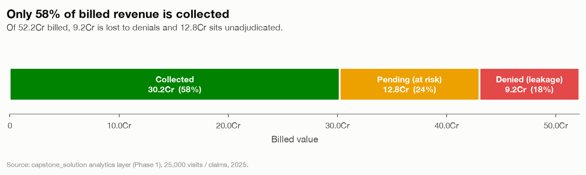
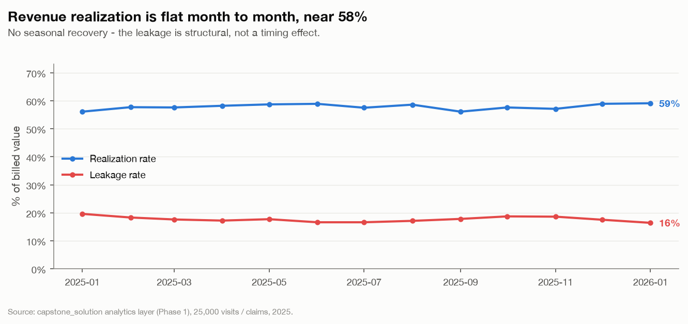
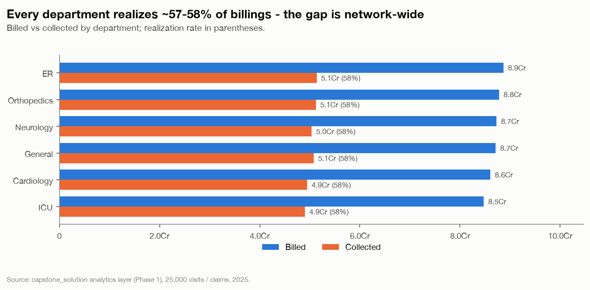
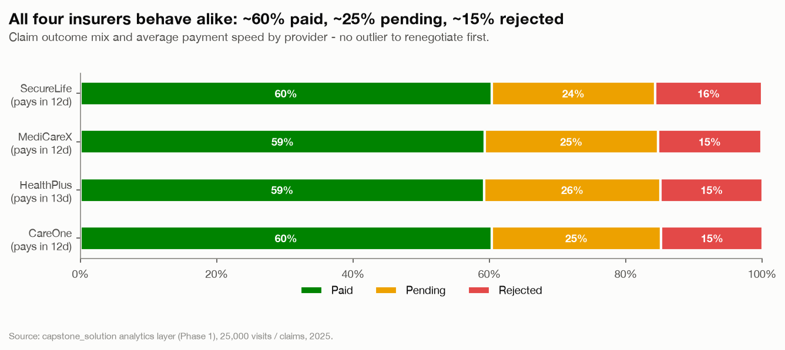
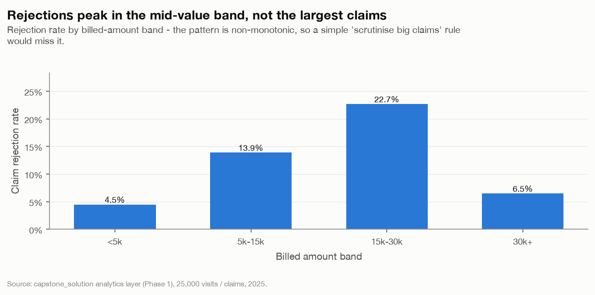
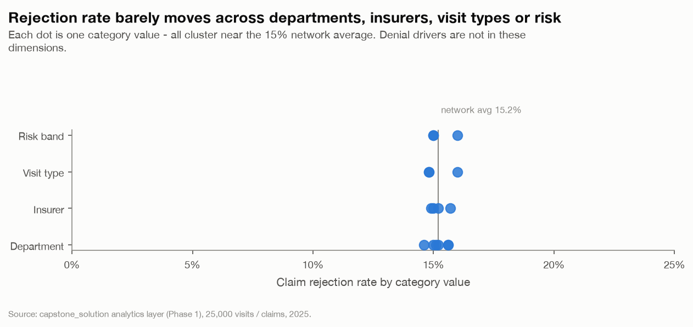
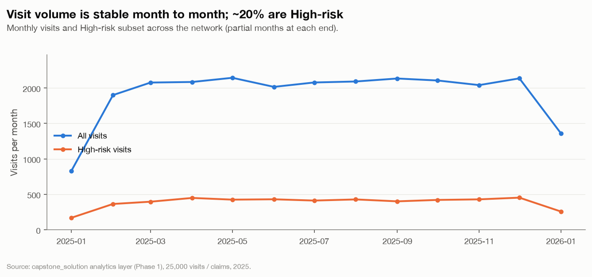
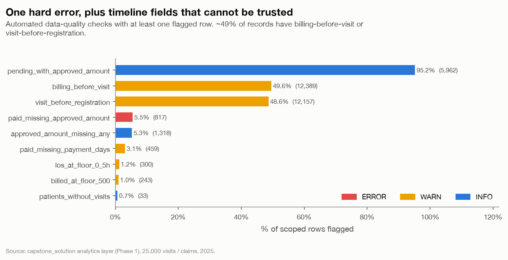
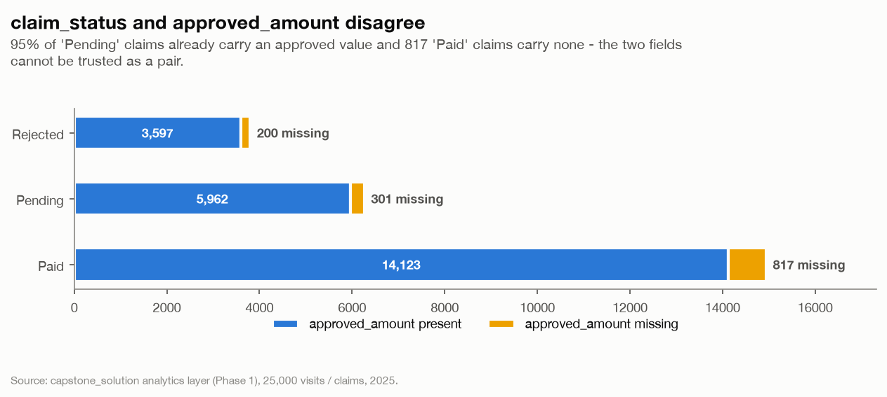
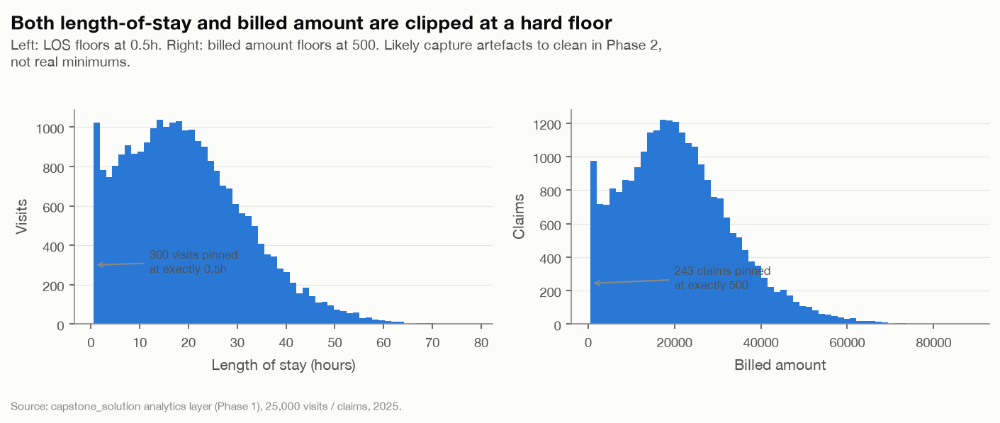

# Phase 1 — SQL Analytics Layer :: Findings

*Hospital Operations & Revenue Risk Intelligence Platform — Business Intelligence Foundation*

- Generated: 2026-09-01T23:28:39+00:00
- Source: `capstone_hospital_analytics` / schema `capstone_solution` — 25,000 visits, 25,000 claims, 5,000 patients (calendar 2025)
- Every finding below is backed by a chart in `output/charts/`; supporting tables are in the appendix.

## Executive summary

1. **Revenue realization is 57.9%** — of 521,768,936 billed, only 302,266,217 is collected. 91,801,945 (17.6%) is lost to adjudicated denials and 127,700,774 (24.5%) is stuck pending.
2. **The leakage is structural, not localised** — realization is ~58% in every department, every insurer and every month. There is no single counterparty to renegotiate or quarter to blame.
3. **Denial drivers are not the obvious dimensions** — rejection rate is flat (~15%) across department, provider, visit type and risk band, but peaks at 22.7% in the mid-value (15k–30k) billed band and is *lower* for the largest claims.
4. **Two source fields cannot be trusted as a pair** — 95% of Pending claims already carry an `approved_amount`; 817 Paid claims carry none.
5. **Timelines are unreliable** — ~49% of records have billing before the visit or the visit before patient registration. Phase 3 time-based validation must key on `visit_date` only.

---

## 1. Revenue realization

*Revenue realization: billed value splits into collected, pending and denied.*

*Monthly realization vs leakage rate.*

*Billed vs collected revenue by department.*

---

## 2. Insurance provider behaviour

*Claim outcome mix by insurance provider.*

---

## 3. Where claim rejections concentrate

*Claim rejection rate by billed-amount band.*

*Rejection rate spread across operational dimensions.*

---

## 4. Patient flow

*Monthly patient-flow volume and High-risk subset.*

---

## 5. Data quality

*Phase 1 data-quality checks, by severity and share of rows flagged.*

*Presence of approved_amount within each claim status.*

*Distributions of length of stay and billed amount, showing floor artefacts.*

**1 ERROR-level check(s) with flagged rows.** Full check list in the appendix; rules live in `sql/05_data_quality.sql`.

---

## Appendix — supporting tables

### Load summary

| Table | Read | Loaded | Rejected |
|---|--:|--:|--:|
| patients | 5,000 | 5,000 | 0 |
| visits | 25,000 | 25,000 | 0 |
| billing | 25,000 | 25,000 | 0 |

### Department performance

| department   |   visits |   unique_patients |   avg_los_hours |   median_los_hours |   avg_los_hours_icu |   high_risk_visits |   high_risk_pct |   er_pct |   icu_pct |   total_billed |   total_collected |   total_leakage |   total_pending |   realization_rate_pct |   rejection_rate_pct |   avg_payment_days |
|:-------------|---------:|------------------:|----------------:|-------------------:|--------------------:|-------------------:|----------------:|---------:|----------:|---------------:|------------------:|----------------:|----------------:|-----------------------:|---------------------:|-------------------:|
| ER           |     4220 |              2850 |           19.53 |              18.12 |               19.52 |                872 |            20.7 |     34   |      32.7 |    8.8687e+07  |       5.13716e+07 |     1.56047e+07 |     2.17107e+07 |                   57.9 |                 15   |               12.6 |
| Orthopedics  |     4164 |              2832 |           19.66 |              18.38 |               19.68 |                842 |            20.2 |     33.4 |      32.6 |    8.78115e+07 |       5.12018e+07 |     1.55523e+07 |     2.10573e+07 |                   58.3 |                 15.6 |               12.7 |
| Neurology    |     4165 |              2857 |           19.72 |              18.63 |               19.45 |                846 |            20.3 |     34   |      32.7 |    8.731e+07   |       5.03946e+07 |     1.53833e+07 |     2.15322e+07 |                   57.7 |                 15.1 |               12.5 |
| General      |     4228 |              2870 |           19.43 |              18.13 |               19.22 |                839 |            19.8 |     33.4 |      32.9 |    8.71315e+07 |       5.07847e+07 |     1.54355e+07 |     2.09113e+07 |                   58.3 |                 15.2 |               12.5 |
| Cardiology   |     4159 |              2817 |           19.6  |              18.01 |               20.03 |                790 |            19   |     34.2 |      32.2 |    8.60713e+07 |       4.94846e+07 |     1.53928e+07 |     2.11939e+07 |                   57.5 |                 15.6 |               12.6 |
| ICU          |     4064 |              2776 |           19.36 |              17.85 |               19.33 |                845 |            20.8 |     32.2 |      34.7 |    8.47578e+07 |       4.9029e+07  |     1.44334e+07 |     2.12953e+07 |                   57.8 |                 14.6 |               12.3 |

### Insurance provider behaviour

| insurance_provider   |   claims |   paid_claims |   pending_claims |   rejected_claims |   paid_rate_pct |   pending_rate_pct |   rejection_rate_pct |   avg_approved_ratio_pct |   avg_payment_days |   p90_payment_days |   total_billed |   total_collected |   total_leakage |   realization_rate_pct |
|:---------------------|---------:|--------------:|-----------------:|------------------:|----------------:|-------------------:|---------------------:|-------------------------:|-------------------:|-------------------:|---------------:|------------------:|----------------:|-----------------------:|
| MediCareX            |     6532 |          3875 |             1661 |               996 |            59.3 |               25.4 |                 15.2 |                     79.5 |               12.5 |                 20 |    1.34591e+08 |       7.79485e+07 |     2.36163e+07 |                   57.9 |
| CareOne              |     6283 |          3787 |             1562 |               934 |            60.3 |               24.9 |                 14.9 |                     80.2 |               12.5 |                 19 |    1.30708e+08 |       7.59848e+07 |     2.25936e+07 |                   58.1 |
| HealthPlus           |     6220 |          3680 |             1609 |               931 |            59.2 |               25.9 |                 15   |                     79.7 |               12.6 |                 20 |    1.30181e+08 |       7.42568e+07 |     2.28366e+07 |                   57   |
| SecureLife           |     5965 |          3598 |             1431 |               936 |            60.3 |               24   |                 15.7 |                     79.4 |               12.5 |                 19 |    1.26289e+08 |       7.40761e+07 |     2.27554e+07 |                   58.7 |

### Data quality report

| check_name                      | severity   | table_scope       |   records_flagged |   records_total |   pct_flagged | description                                                                                          |
|:--------------------------------|:-----------|:------------------|------------------:|----------------:|--------------:|:-----------------------------------------------------------------------------------------------------|
| paid_missing_approved_amount    | ERROR      | billing           |               817 |           14940 |          5.47 | Paid claims with no approved_amount                                                                  |
| visits_without_billing          | ERROR      | visits            |                 0 |           25000 |          0    | Visits with no billing record (expected 1:1)                                                         |
| rejected_with_positive_approved | ERROR      | billing           |                 0 |            3797 |          0    | Rejected claims that nonetheless carry an approved_amount                                            |
| approved_exceeds_billed         | ERROR      | billing           |                 0 |           25000 |          0    | approved_amount greater than billed_amount                                                           |
| billing_before_visit            | WARN       | billing + visits  |             12389 |           25000 |         49.56 | billing_date precedes visit_date                                                                     |
| visit_before_registration       | WARN       | visits + patients |             12157 |           25000 |         48.63 | visit_date precedes patient registration_date -> registration_date is not a reliable temporal anchor |
| paid_missing_payment_days       | WARN       | billing           |               459 |           14940 |          3.07 | Paid claims with no payment_days                                                                     |
| los_at_floor_0_5h               | WARN       | visits            |               300 |           25000 |          1.2  | Length of stay exactly 0.5h -> likely a clipped / censored minimum                                   |
| billed_at_floor_500             | WARN       | billing           |               243 |           25000 |          0.97 | billed_amount exactly 500 -> likely a floor value                                                    |
| pending_with_approved_amount    | INFO       | billing           |              5962 |            6263 |         95.19 | Pending claims that already carry an approved_amount                                                 |
| approved_amount_missing_any     | INFO       | billing           |              1318 |           25000 |          5.27 | Billing rows with a NULL approved_amount (any status)                                                |
| patients_without_visits         | INFO       | patients          |                33 |            5000 |          0.66 | Registered patients with zero visits                                                                 |
