# Phase 2 - Exploratory Data Analysis & Data Quality :: Findings

*Hospital Operations & Revenue Risk Intelligence Platform - modelling readiness*

- Generated: 2026-09-02T00:21:46+00:00
- Source: `capstone_hospital_analytics` / `capstone_solution.v_visit_billing` - 25,000 visits, 25,000 claims, 5,000 patients (2025-01-20 to 2026-01-20)
- Every finding is backed by a chart in `output/charts/`; supporting numbers are in the appendix and as CSVs in `output/`.
- Artefacts for Phase 3: `feature_spec.yaml` (catalogue + leakage register), `data_quality_rules.py` (validators), `output/feature_frame.*` (as-of matrix).

## Executive summary

1. **Model A (visit risk) has no learnable signal.** Every eligible feature sits at the permuted-target noise floor (best < 0.5% of target entropy). `risk_score` is effectively randomly assigned - Phase 3 should expect near-base-rate performance and treat Model A as a monitoring baseline, not a predictor.
2. **Model B (claim outcome) is a billed-amount model.** `billed_amount` / `billed_band` are the only features above the noise floor; rejection rate is **non-monotonic** - 22.7% at 15k-30k vs 4.5% below 5k and 6.5% above 30k - and that mid band is 70% of denial leakage.
3. **Targets are imbalanced toward the cheap class.** risk_score 50/30/20 (Low/Med/High); claim_status 60/25/15 (Paid/Pending/Rejected). Class weighting and threshold tuning are mandatory; recall on High / Rejected is the headline metric.
4. **Four Phase 1 data-quality findings are now quantified and have a written handling policy** (below): the 0.5h / 500 capture floors (keep + flag), the status<->approved_amount decoupling (analysis-only, both post-outcome), ~5% MCAR missingness on the two billing outcome fields (impute for reporting only), and the temporal inconsistency (~50% billing-before-visit) -> **`visit_date` is the only temporal key**.
5. **The business is structurally uniform.** No seasonality, no weekday pattern, near-identical departments and insurers, no length-of-stay drivers. Planning levers are network-level (risk mix, billed-amount triage), not local.

---

## 1. Model targets & feature signal

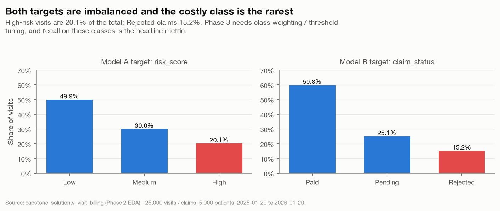

*Class balance for both model targets - the expensive class (High / Rejected) is the smallest.*

Mutual-information screen of the candidate features against each target (27 fields eligible for Model A, 34 for Model B), with a permuted-target run as the noise floor:

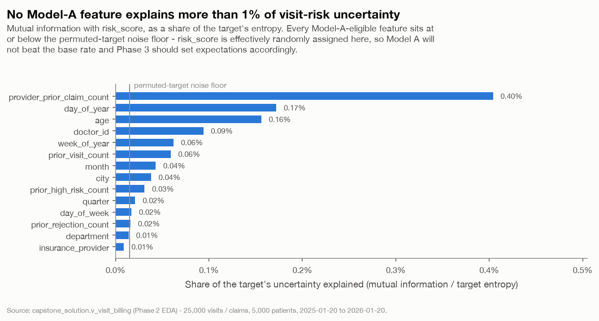

*Model-A feature signal vs risk_score - all at the noise floor.*

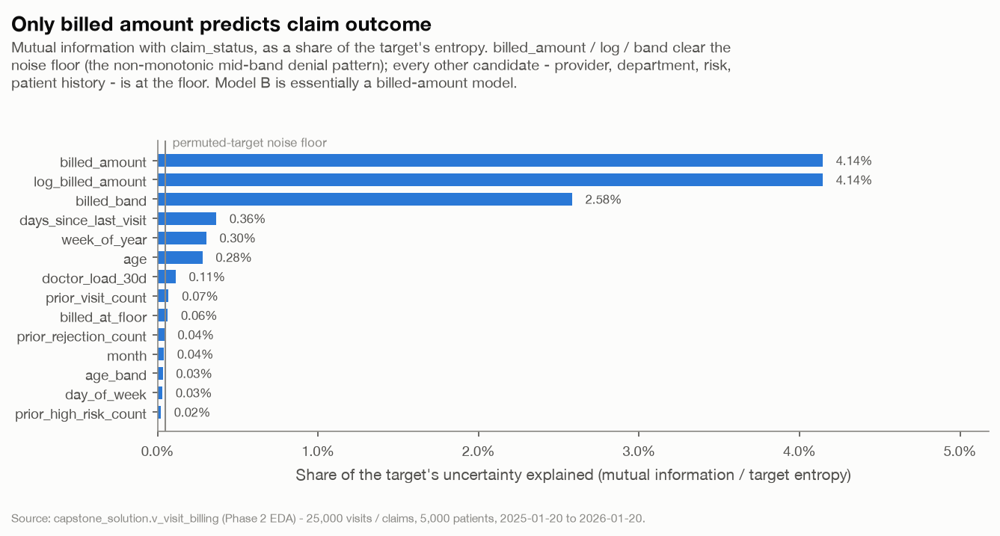

*Model-B feature signal vs claim_status - billed amount is the only signal.*

> **Implication for Phase 3.** Model A cannot beat a stratified baseline on this data; ship it as a calibrated base-rate model and document the ceiling. Model B has a real but narrow signal - a regularised linear model on `billed_amount` + a spline / band term is the honest baseline; gradient boosting will mostly re-learn the band shape.

---

## 2. Data quality - findings formalised

### 2.1 Capture floors

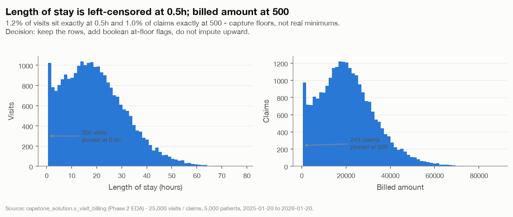

*LOS and billed-amount distributions with their capture floors.*

### 2.2 claim_status <-> approved_amount decoupling

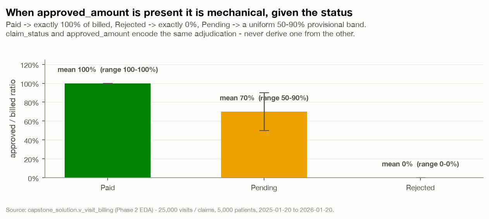

*approved/billed ratio by claim status - deterministic for Paid & Rejected.*

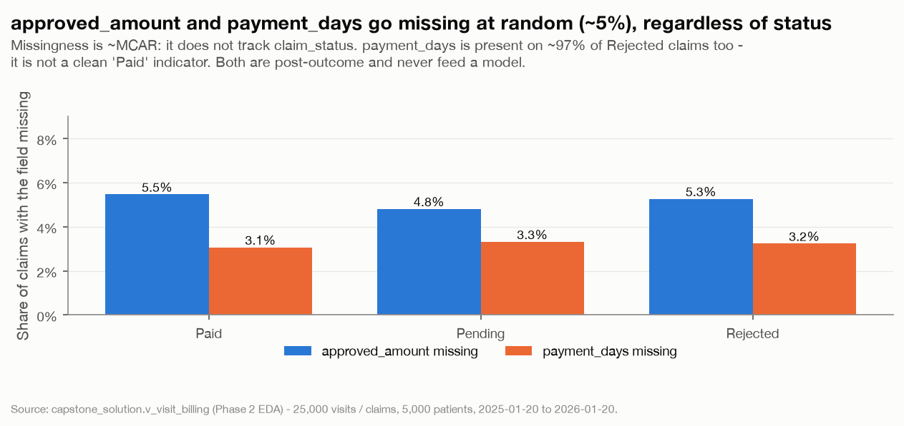

*Missing rate of approved_amount / payment_days by status - flat ~5%, i.e. MCAR.*

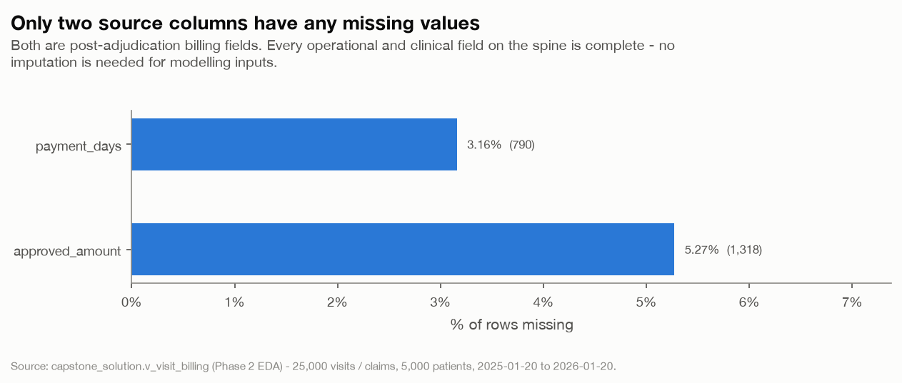

*Missing-value share by spine column - only approved_amount and payment_days.*

### 2.3 Temporal inconsistency

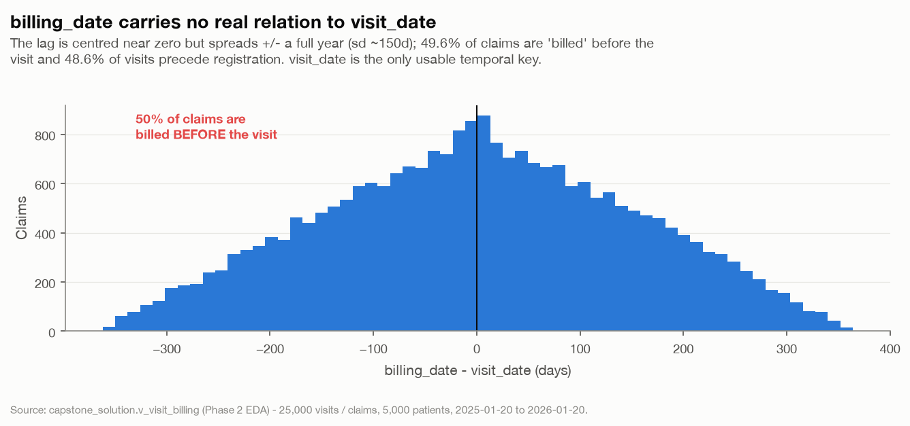

*Distribution of billing_date - visit_date: noise, ~50% negative.*

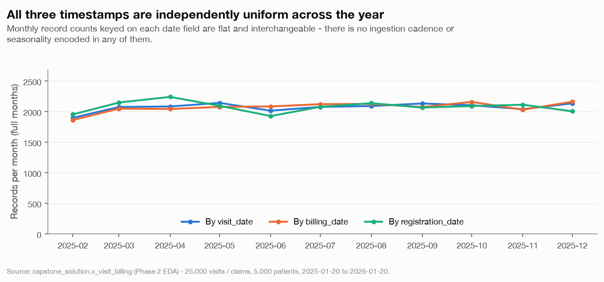

*Monthly counts by visit / billing / registration date - all flat and independent.*

### 2.4 Handling policy

| Finding | Decision | Rationale |
|---|---|---|
| length_of_stay_hours == 0.5h floor (1.2% of visits) | **keep + flag** | The 0.5h value is a left-censored capture minimum, not a data error. LOS carries no measurable signal for either target, so no imputation is warranted; add a boolean `los_at_floor` flag and keep the row. |
| billed_amount == 500 floor (1.0% of claims) | **keep + flag** | 500 is a billing-system minimum charge. billed_amount is the strongest single predictor of claim outcome, so the rows stay; add `billed_at_floor`. |
| approved_amount missing (~5.3% of all claims, ~MCAR across statuses) | **impute for reporting / exclude as a feature** | Missingness is ~5% and independent of claim_status (5.5% Paid, 4.8% Pending, 5.3% Rejected) - missing-completely-at-random capture loss. For revenue reporting, impute deterministically from status: Paid -> billed_amount, Rejected -> 0, Pending -> leave null (genuinely unknown). approved_amount is a post-adjudication outcome and never enters a model. |
| payment_days missing (~3.2% of claims) and present on non-Paid claims | **impute for reporting / exclude as a feature** | payment_days is present for ~97% of claims regardless of status (incl. Rejected), so it is not a clean 'Paid-only' field. It is a post-outcome field - excluded from both models. For payment-speed reporting, restrict to Paid claims with a non-null value. |
| claim_status <-> approved_amount decoupling | **keep, treat as separate fields** | 95% of Pending claims already carry an approved_amount (a provisional figure) and the Paid/Rejected approved ratio is deterministic (100% / 0%). The fields describe different moments; never derive one from the other for adjudicated logic. Revenue math uses the view's collected_amount / leakage_amount, which already encode the rule. |
| Temporal inconsistency (~50% billing-before-visit, ~49% visit-before-registration) | **keep, use visit_date only** | billing_date, registration_date and visit_date are independently ~uniform over the same 12-month window - their relative order is noise. `visit_date` is the ONLY usable temporal key: it anchors all time-based splits and every as-of feature. billing_lag_days, days-since-registration and any feature derived from date differences are forbidden. |
| billed_amount / length_of_stay_hours right-tail outliers (IQR: ~1.5% / ~1.0%) | **keep (winsorise only inside the model pipeline if needed)** | The upper tails are smooth and plausible (max billed 88.5k, max LOS 78h) - real variation, not errors. Keep all rows; if a linear model is sensitive, cap at the 99th percentile inside the Phase 3 ColumnTransformer, not in the source data. |
| 33 registered patients with zero visits | **keep in patient master / absent from the spine** | Expected - not every registered patient is seen in the window. They do not appear in v_visit_billing so they never reach a model; no action. |

Validators for all of the above live in `data_quality_rules.py` (`validate(df)`, `add_quality_flags(df)`, `apply_training_exclusions(df)`), importable by Phase 3 and the Phase 5/6 request gate.

---

## 3. Business analyses

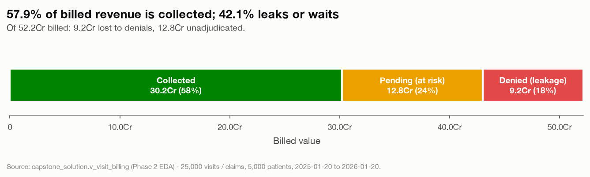

*Revenue realization waterfall: billed value splits into collected, pending and denied.*

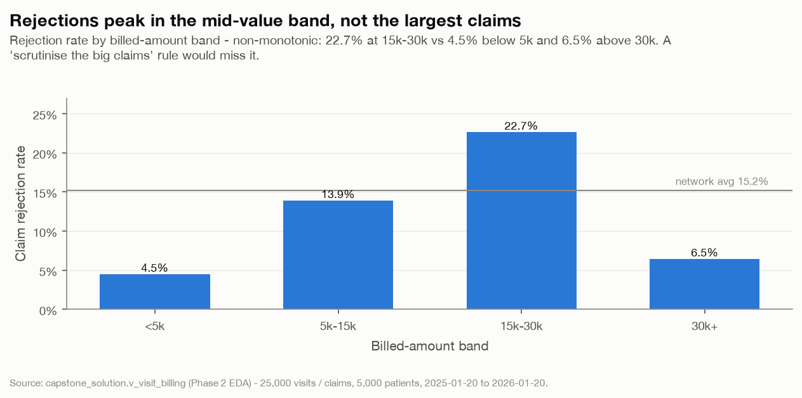

*Claim rejection rate by billed-amount band (non-monotonic, peaks mid-band).*

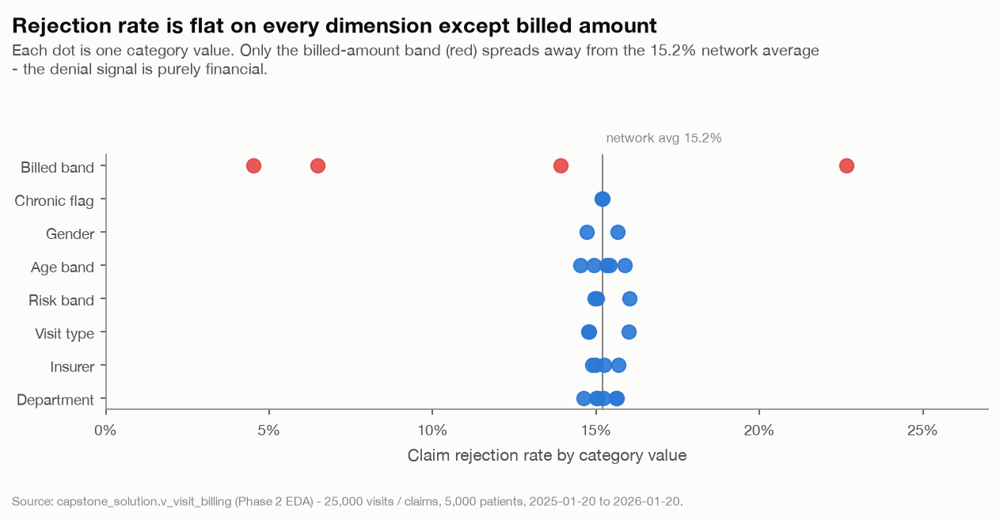

*Rejection-rate spread across operational dimensions - only billed band moves.*

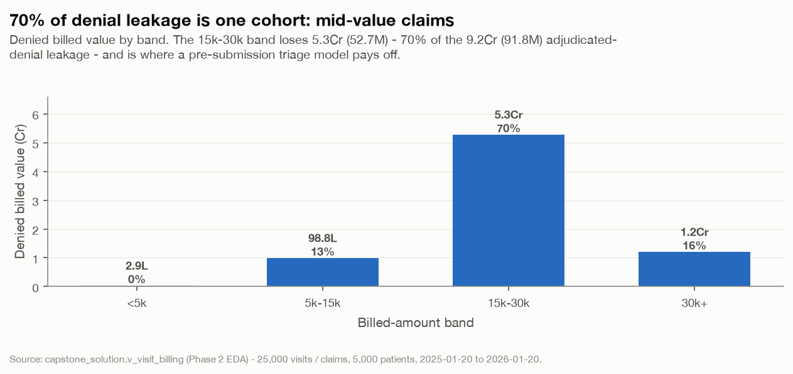

*Denied billed value by band - the mid band is 70% of denial leakage.*

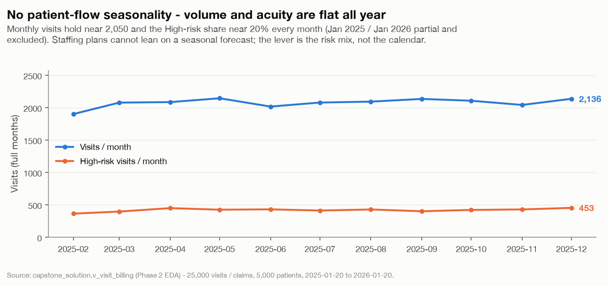

*Monthly visit volume and High-risk subset - flat, no seasonality.*

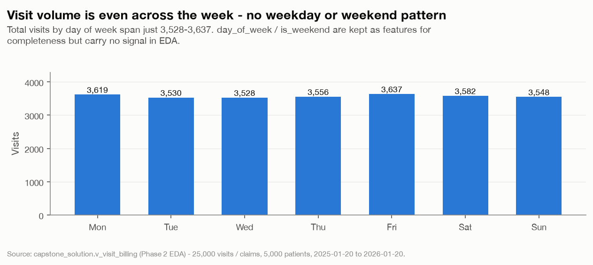

*Visits by day of week - flat.*

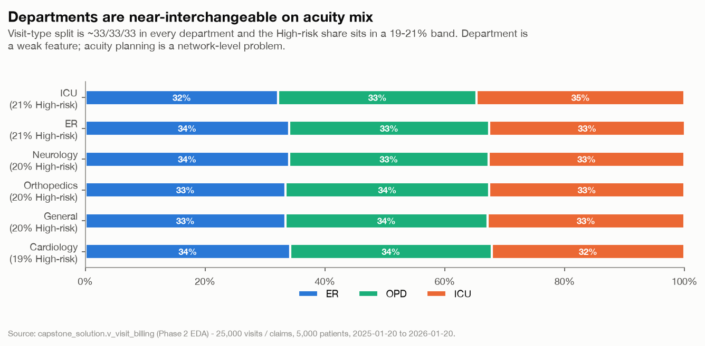

*Visit-type mix and High-risk share by department - uniform.*

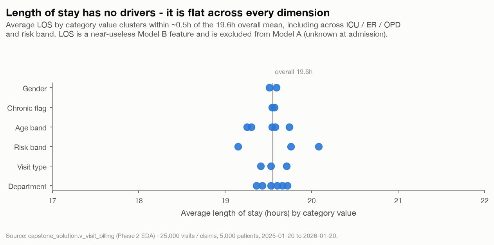

*Average length of stay by dimension - no meaningful variation.*

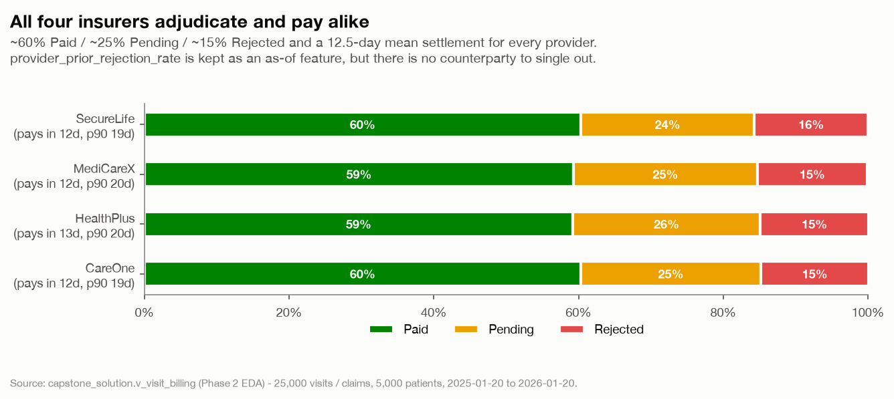

*Claim-outcome mix and payment speed by insurer - near-identical.*

---

## 4. Feature engineering & leakage register

`feature_spec.yaml` catalogues **43 fields** - 27 eligible for Model A, 34 for Model B - each with a definition, a source, an as-of rule keyed on `visit_date`, a dtype and a per-model leakage verdict. The as-of matrix is materialised at `output/feature_frame.*` (25000 rows x 41 cols).

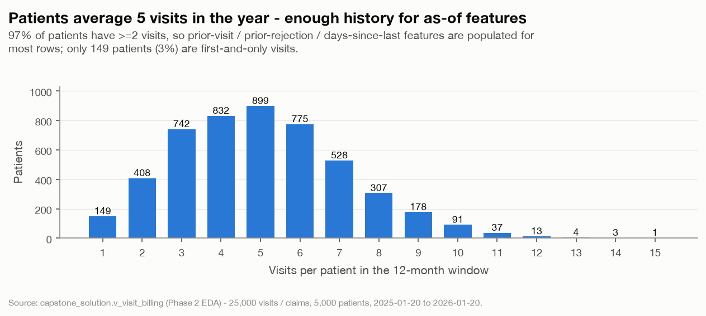

*Distribution of visits per patient - supports the patient-history feature block.*

**Leakage rules (enforced by `run_phase2.py` step 5):**

- `visit_date` is the sole temporal key. No feature derives from `billing_date` or `registration_date` (including `billing_lag_days`, days-since-registration).
- No post-outcome field (`approved_amount`, `payment_days`, `claim_status`, `collected/leakage/pending_amount`) feeds Model A or the pre-submission Model B.
- `length_of_stay_hours` and `billed_amount` are **excluded from Model A** (not known at admission / not an operational field) but **allowed for Model B** (known before the claim is filed).
- `risk_score` is the Model A target and a legitimate Model B input.
- Patient- and provider-history features count only visits with `visit_date` strictly earlier than the current visit.

### Feature catalogue

| feature                       | dtype    | source                               | definition                                                             | as_of_rule                                                      | model_a_verdict   | model_b_verdict   | notes                                                                                                                                             |
|:------------------------------|:---------|:-------------------------------------|:-----------------------------------------------------------------------|:----------------------------------------------------------------|:------------------|:------------------|:--------------------------------------------------------------------------------------------------------------------------------------------------|
| prior_visit_count             | int      | visits (self-join on patient_id)     | Number of the patient's earlier visits.                                | visits with visit_date strictly < this visit_date               | allow             | allow             | Uses only the existence of prior visits, not their outcomes.                                                                                      |
| prior_high_risk_count         | int      | visits.risk_score of prior visits    | Count of the patient's prior visits scored High risk.                  | prior visits only (visit_date <)                                | allow             | allow             | risk_score of *past* visits is history, not the current label.                                                                                    |
| prior_rejection_count         | int      | billing.claim_status of prior visits | Count of the patient's prior claims that were Rejected.                | prior visits only (visit_date <)                                | allow             | allow             | Assumes prior claims are adjudicated by now; claim_status of the CURRENT visit is never used.                                                     |
| prior_rejection_rate          | float    | derived                              | prior_rejection_count / prior_visit_count (NaN if no prior visit).     | prior visits only                                               | allow             | allow             | Patient-level denial propensity.                                                                                                                  |
| days_since_last_visit         | float    | visits                               | Days between this visit_date and the patient's previous visit_date.    | prior visits only                                               | allow             | allow             | NaN for first visit - impute with a large sentinel or a missing flag.                                                                             |
| is_first_visit                | bool     | derived                              | True when the patient has no earlier visit.                            | prior visits only                                               | allow             | allow             |                                                                                                                                                   |
| has_prior_visit               | bool     | derived                              | Negation of is_first_visit.                                            | prior visits only                                               | allow             | allow             |                                                                                                                                                   |
| department                    | category | visits.department                    | Clinical department of the visit.                                      | known at visit time                                             | allow             | allow             |                                                                                                                                                   |
| visit_type                    | category | visits.visit_type                    | ER / OPD / ICU.                                                        | known at visit time                                             | allow             | allow             |                                                                                                                                                   |
| age                           | int      | patients.age                         | Patient age in years.                                                  | static patient attribute                                        | allow             | allow             |                                                                                                                                                   |
| age_band                      | category | derived from patients.age            | 0-17 / 18-34 / 35-49 / 50-64 / 65+.                                    | static                                                          | allow             | allow             |                                                                                                                                                   |
| gender                        | category | patients.gender                      | Patient gender (M/F).                                                  | static                                                          | allow             | allow             | Monitor for fairness in Phase 4; not a driver in EDA.                                                                                             |
| city                          | category | patients.city                        | Patient home city (network has 6).                                     | static                                                          | allow             | allow             |                                                                                                                                                   |
| chronic_flag                  | int      | patients.chronic_flag                | 1 if the patient is flagged chronic.                                   | static (assumed known at visit)                                 | allow             | allow             |                                                                                                                                                   |
| doctor_id                     | category | visits.doctor_id                     | Attending doctor identifier (101 doctors).                             | known at visit time                                             | allow             | allow             | High cardinality - target/impact encode or drop in Phase 3.                                                                                       |
| doctor_load_30d               | int      | derived from visits                  | Count of the attending doctor's other visits in the prior 30 days.     | visits with visit_date in [D-30, D-1]                           | allow             | allow             | Operational load proxy.                                                                                                                           |
| length_of_stay_hours          | float    | visits.length_of_stay_hours          | Recorded length of stay in hours (floored at 0.5h).                    | known at/after discharge - BEFORE claim submission              | exclude           | allow             | Model A predicts risk at/around admission, so LOS is not yet known and is excluded. It is known before the claim is filed, so Model B may use it. |
| los_at_floor                  | bool     | derived                              | True when length_of_stay_hours == 0.5 (capture floor).                 | same as length_of_stay_hours                                    | exclude           | allow             | Pairs with length_of_stay_hours.                                                                                                                  |
| billed_amount                 | float    | billing.billed_amount                | Amount billed on the claim.                                            | set when the claim is prepared - BEFORE submission/adjudication | exclude           | allow             | Not an operational/clinical field, so excluded from Model A. It is the single strongest predictor of claim outcome for Model B.                   |
| log_billed_amount             | float    | derived                              | log1p(billed_amount).                                                  | same as billed_amount                                           | exclude           | allow             |                                                                                                                                                   |
| billed_band                   | category | derived from billing.billed_amount   | <5k / 5k-15k / 15k-30k / 30k+.                                         | same as billed_amount                                           | exclude           | allow             | Captures the non-monotonic rejection pattern.                                                                                                     |
| billed_at_floor               | bool     | derived                              | True when billed_amount == 500 (capture floor).                        | same as billed_amount                                           | exclude           | allow             |                                                                                                                                                   |
| insurance_provider            | category | patients.insurance_provider          | Claim's insurer (4 providers).                                         | static patient attribute                                        | allow             | allow             | Known pre-submission; behaviour is near-identical across the 4 in EDA.                                                                            |
| provider_prior_claim_count    | float    | derived from billing                 | Number of the insurer's claims from earlier visits.                    | visits with visit_date strictly <                               | allow             | allow             |                                                                                                                                                   |
| provider_prior_rejection_rate | float    | derived from billing                 | Rejected / total for the insurer over earlier visits (NaN before any). | visits with visit_date strictly <                               | allow             | allow             | As-of denial rate of the counterparty; uses only resolved past claims.                                                                            |
| visit_month                   | category | derived from visits.visit_date       | Calendar month of the visit (YYYY-MM).                                 | the visit_date itself                                           | allow             | allow             |                                                                                                                                                   |
| month                         | int      | derived from visits.visit_date       | Month number 1-12.                                                     | the visit_date itself                                           | allow             | allow             |                                                                                                                                                   |
| day_of_week                   | int      | derived from visits.visit_date       | 0=Mon .. 6=Sun.                                                        | the visit_date itself                                           | allow             | allow             |                                                                                                                                                   |
| day_name                      | category | derived from visits.visit_date       | Weekday name.                                                          | the visit_date itself                                           | allow             | allow             |                                                                                                                                                   |
| is_weekend                    | bool     | derived from visits.visit_date       | True for Sat/Sun.                                                      | the visit_date itself                                           | allow             | allow             |                                                                                                                                                   |
| week_of_year                  | int      | derived from visits.visit_date       | ISO week number 1-53.                                                  | the visit_date itself                                           | allow             | allow             |                                                                                                                                                   |
| quarter                       | int      | derived from visits.visit_date       | Calendar quarter 1-4.                                                  | the visit_date itself                                           | allow             | allow             |                                                                                                                                                   |
| day_of_year                   | int      | derived from visits.visit_date       | Ordinal day 1-366.                                                     | the visit_date itself                                           | allow             | allow             |                                                                                                                                                   |
| risk_score                    | category | visits.risk_score                    | Clinical risk band assigned to the visit.                              | POST visit assessment                                           | target            | allow             | Target of Model A. Known before the claim is filed, so Model B may use it as an input.                                                            |
| claim_status                  | category | billing.claim_status                 | Adjudication outcome Paid/Pending/Rejected.                            | POST adjudication                                               | exclude           | target            | Target of Model B. Post-outcome for Model A.                                                                                                      |
| approved_amount               | float    | billing.approved_amount              | Amount the insurer approved.                                           | POST adjudication                                               | exclude           | exclude           | Post-outcome. Forbidden for BOTH models. Reporting-only, deterministically imputable from claim_status.                                           |
| payment_days                  | float    | billing.payment_days                 | Days from billing to payment.                                          | POST payment                                                    | exclude           | exclude           | Post-outcome. Forbidden for BOTH models. Present on ~97% of claims of every status, so not even a clean Paid indicator.                           |
| billing_date                  | date     | billing.billing_date                 | Recorded claim date.                                                   | unreliable - ~50% precede visit_date                            | exclude           | exclude           | Ordering is noise. No feature may be derived from it, including billing_lag_days.                                                                 |
| registration_date             | date     | patients.registration_date           | Recorded patient registration date.                                    | unreliable - ~49% follow the visit                              | exclude           | exclude           | Not a temporal anchor; days-since-registration is forbidden.                                                                                      |
| billing_lag_days              | int      | derived (billing_date - visit_date)  | Day difference billing_date - visit_date.                              | unreliable                                                      | exclude           | exclude           | Derived from billing_date; pure noise (mean ~1d, sd ~150d).                                                                                       |
| collected_amount              | float    | v_visit_billing derived              | Cash collected (approved value on Paid claims).                        | POST adjudication                                               | exclude           | exclude           | Post-outcome. Reporting only.                                                                                                                     |
| leakage_amount                | float    | v_visit_billing derived              | Billed minus approved on adjudicated claims.                           | POST adjudication                                               | exclude           | exclude           | Reporting only.                                                                                                                                   |
| pending_amount                | float    | v_visit_billing derived              | Billed value of Pending claims.                                        | POST adjudication                                               | exclude           | exclude           | Reporting only.                                                                                                                                   |

---

## Appendix - supporting tables

### Column profile (spine)

| column               | dtype         |     n |   n_missing |   pct_missing |   n_unique |    min |      p25 |   median |     mean |      p75 |      max |      std |    skew | top_value           |   top_share_pct |
|:---------------------|:--------------|------:|------------:|--------------:|-----------:|-------:|---------:|---------:|---------:|---------:|---------:|---------:|--------:|:--------------------|----------------:|
| visit_id             | int64         | 25000 |           0 |         0     |      25000 |    1   |  6250.75 | 12500.5  | 12500.5  | 18750.2  | 25000    |  7217.02 |   0     | nan                 |          nan    |
| visit_date           | datetime64[s] | 25000 |           0 |         0     |        366 |  nan   |   nan    |   nan    |   nan    |   nan    |   nan    |   nan    | nan     | 2025-08-05 00:00:00 |            0.38 |
| visit_month          | object        | 25000 |           0 |         0     |         13 |  nan   |   nan    |   nan    |   nan    |   nan    |   nan    |   nan    | nan     | 2025-05-01          |            8.58 |
| patient_id           | int64         | 25000 |           0 |         0     |       4967 |    1   |  1249    |  2505    |  2509.52 |  3764    |  5000    |  1448.69 |  -0.003 | nan                 |          nan    |
| age                  | int64         | 25000 |           0 |         0     |         90 |    1   |    33    |    45    |    44.77 |    57    |    90    |    17.78 |  -0.03  | nan                 |          nan    |
| age_band             | str           | 25000 |           0 |         0     |          5 |  nan   |   nan    |   nan    |   nan    |   nan    |   nan    |   nan    | nan     | 35-49               |           31.33 |
| gender               | str           | 25000 |           0 |         0     |          2 |  nan   |   nan    |   nan    |   nan    |   nan    |   nan    |   nan    | nan     | F                   |           50.96 |
| city                 | str           | 25000 |           0 |         0     |          6 |  nan   |   nan    |   nan    |   nan    |   nan    |   nan    |   nan    | nan     | Hyderabad           |           17.48 |
| insurance_provider   | str           | 25000 |           0 |         0     |          4 |  nan   |   nan    |   nan    |   nan    |   nan    |   nan    |   nan    | nan     | MediCareX           |           26.13 |
| chronic_flag         | int64         | 25000 |           0 |         0     |          2 |    0   |     0    |     1    |     0.5  |     1    |     1    |     0.5  |  -0.01  | nan                 |          nan    |
| registration_date    | datetime64[s] | 25000 |           0 |         0     |        366 |  nan   |   nan    |   nan    |   nan    |   nan    |   nan    |   nan    | nan     | 2025-10-20 00:00:00 |            0.47 |
| department           | str           | 25000 |           0 |         0     |          6 |  nan   |   nan    |   nan    |   nan    |   nan    |   nan    |   nan    | nan     | General             |           16.91 |
| visit_type           | str           | 25000 |           0 |         0     |          3 |  nan   |   nan    |   nan    |   nan    |   nan    |   nan    |   nan    | nan     | ER                  |           33.53 |
| length_of_stay_hours | float64       | 25000 |           0 |         0     |       4935 |    0.5 |     9.96 |    18.2  |    19.55 |    27.31 |    78.42 |    12.31 |   0.658 | nan                 |          nan    |
| risk_score           | str           | 25000 |           0 |         0     |          3 |  nan   |   nan    |   nan    |   nan    |   nan    |   nan    |   nan    | nan     | Low                 |           49.88 |
| is_high_risk         | bool          | 25000 |           0 |         0     |          2 |  nan   |   nan    |   nan    |   nan    |   nan    |   nan    |   nan    | nan     | False               |           79.86 |
| doctor_id            | int64         | 25000 |           0 |         0     |        101 |  100   |   125    |   151    |   150.17 |   175    |   200    |    29.14 |  -0.011 | nan                 |          nan    |
| bill_id              | int64         | 25000 |           0 |         0     |      25000 |    1   |  6250.75 | 12500.5  | 12500.5  | 18750.2  | 25000    |  7217.02 |   0     | nan                 |          nan    |
| billing_date         | datetime64[s] | 25000 |           0 |         0     |        366 |  nan   |   nan    |   nan    |   nan    |   nan    |   nan    |   nan    | nan     | 2025-07-14 00:00:00 |            0.4  |
| billing_month        | object        | 25000 |           0 |         0     |         13 |  nan   |   nan    |   nan    |   nan    |   nan    |   nan    |   nan    | nan     | 2025-12-01          |            8.65 |
| billed_amount        | float64       | 25000 |           0 |         0     |      24695 |  500   | 11582.5  | 19644.8  | 20870.8  | 28398.1  | 88539    | 12606.3  |   0.691 | nan                 |          nan    |
| approved_amount      | float64       | 25000 |        1318 |         5.272 |      19882 |    0   |  4603.07 | 14379.6  | 16348.1  | 24845    | 88539    | 13778.8  |   0.827 | nan                 |          nan    |
| claim_status         | str           | 25000 |           0 |         0     |          3 |  nan   |   nan    |   nan    |   nan    |   nan    |   nan    |   nan    | nan     | Paid                |           59.76 |
| payment_days         | float64       | 25000 |         790 |         3.16  |         53 |    1   |     8    |    13    |    13.05 |    17    |    55    |     7.24 |   0.694 | nan                 |          nan    |
| is_paid              | bool          | 25000 |           0 |         0     |          2 |  nan   |   nan    |   nan    |   nan    |   nan    |   nan    |   nan    | nan     | True                |           59.76 |
| is_pending           | bool          | 25000 |           0 |         0     |          2 |  nan   |   nan    |   nan    |   nan    |   nan    |   nan    |   nan    | nan     | False               |           74.95 |
| is_rejected          | bool          | 25000 |           0 |         0     |          2 |  nan   |   nan    |   nan    |   nan    |   nan    |   nan    |   nan    | nan     | False               |           84.81 |
| collected_amount     | float64       | 25000 |           0 |         0     |      13944 |    0   |     0    |  4996.21 | 12090.6  | 22010.5  | 88539    | 14825.5  |   1.12  | nan                 |          nan    |
| leakage_amount       | float64       | 25000 |           0 |         0     |       4595 |    0   |     0    |     0    |  3672.08 |     0    | 78054.8  |  8633.61 |   2.418 | nan                 |          nan    |
| pending_amount       | float64       | 25000 |           0 |         0     |       6201 |    0   |     0    |     0    |  5108.03 |   500    | 76253.4  | 10696.8  |   2.224 | nan                 |          nan    |
| billing_lag_days     | int64         | 25000 |           0 |         0     |        720 | -362   |  -106    |     1    |     1.15 |   109    |   364    |   149.52 |  -0.02  | nan                 |          nan    |
| billed_band          | category      | 25000 |           0 |         0     |          4 |  nan   |   nan    |   nan    |   nan    |   nan    |   nan    |   nan    | nan     | 15k-30k             |           43.57 |
| approved_ratio       | float64       | 25000 |        1318 |         5.272 |       5964 |    0   |     0.66 |     1    |     0.77 |     1    |     1    |     0.36 |  -1.425 | nan                 |          nan    |

### Target balance

**risk_score**

| class   |     n |   share_pct |
|:--------|------:|------------:|
| Low     | 12470 |       49.88 |
| Medium  |  7496 |       29.98 |
| High    |  5034 |       20.14 |

**claim_status**

| class    |     n |   share_pct |
|:---------|------:|------------:|
| Paid     | 14940 |       59.76 |
| Pending  |  6263 |       25.05 |
| Rejected |  3797 |       15.19 |

### Data-quality report

| rule                       | severity   | scope         | handling   |   records_flagged |   records_total |   pct_flagged | applicable   | description                                                                        |
|:---------------------------|:-----------|:--------------|:-----------|------------------:|----------------:|--------------:|:-------------|:-----------------------------------------------------------------------------------|
| paid_missing_approved      | ERROR      | billing       | impute     |               817 |           25000 |         3.268 | True         | Paid claim with no approved_amount                                                 |
| gender_enum                | ERROR      | patient       | exclude    |                 0 |           25000 |         0     | True         | gender outside {M,F}                                                               |
| visit_type_enum            | ERROR      | visit         | exclude    |                 0 |           25000 |         0     | True         | visit_type outside {ER,OPD,ICU}                                                    |
| risk_score_enum            | ERROR      | visit         | exclude    |                 0 |           25000 |         0     | True         | risk_score outside {Low,Medium,High}                                               |
| claim_status_enum          | ERROR      | billing       | exclude    |                 0 |           25000 |         0     | True         | claim_status outside {Paid,Pending,Rejected}                                       |
| age_range                  | ERROR      | patient       | exclude    |                 0 |           25000 |         0     | True         | age outside [0, 120]                                                               |
| los_negative               | ERROR      | visit         | exclude    |                 0 |           25000 |         0     | True         | length_of_stay_hours < 0                                                           |
| billed_negative            | ERROR      | billing       | exclude    |                 0 |           25000 |         0     | True         | billed_amount < 0                                                                  |
| approved_exceeds_billed    | ERROR      | billing       | exclude    |                 0 |           25000 |         0     | True         | approved_amount > billed_amount                                                    |
| approved_negative          | ERROR      | billing       | exclude    |                 0 |           25000 |         0     | True         | approved_amount < 0                                                                |
| rejected_with_approved     | ERROR      | billing       | review     |                 0 |           25000 |         0     | True         | Rejected claim that still carries a positive approved_amount                       |
| billing_before_visit       | WARN       | billing+visit | keep       |             12389 |           25000 |        49.556 | True         | billing_date precedes visit_date - date ordering is unreliable                     |
| visit_before_registration  | WARN       | visit+patient | keep       |             12157 |           25000 |        48.628 | True         | visit_date precedes registration_date - registration_date is not a temporal anchor |
| paid_missing_payment_days  | WARN       | billing       | impute     |               459 |           25000 |         1.836 | True         | Paid claim with no payment_days                                                    |
| department_enum            | WARN       | visit         | review     |                 0 |           25000 |         0     | True         | department not in the known set                                                    |
| city_enum                  | WARN       | patient       | review     |                 0 |           25000 |         0     | True         | city not in the known set                                                          |
| provider_enum              | WARN       | patient       | review     |                 0 |           25000 |         0     | True         | insurance_provider not in the known set                                            |
| payment_days_negative      | WARN       | billing       | impute     |                 0 |           25000 |         0     | True         | payment_days < 0                                                                   |
| pending_with_approved      | INFO       | billing       | flag       |              5962 |           25000 |        23.848 | True         | Pending claim that already carries an approved_amount (pre-adjudication value)     |
| rejected_with_payment_days | INFO       | billing       | flag       |              3674 |           25000 |        14.696 | True         | Rejected claim that carries payment_days (payment_days is not tied to Paid)        |
| los_at_floor               | INFO       | visit         | flag       |               300 |           25000 |         1.2   | True         | length_of_stay_hours pinned at the 0.5h capture floor                              |
| billed_at_floor            | INFO       | billing       | flag       |               243 |           25000 |         0.972 | True         | billed_amount pinned at the 500 capture floor                                      |

### Denial cohort (by billed band)

| billed_band   |   claims |   rejected |   pending |   paid |   total_billed |    denied_billed |   rejection_rate_pct |   pending_rate_pct |   paid_rate_pct |   denied_share_of_leakage_pct |
|:--------------|---------:|-----------:|----------:|-------:|---------------:|-----------------:|---------------------:|-------------------:|----------------:|------------------------------:|
| <5k           |     2461 |        111 |       624 |   1726 |    6.19548e+06 | 288362           |                 4.51 |              25.36 |           70.13 |                          0.39 |
| 5k-15k        |     6237 |        868 |      1606 |   3763 |    6.45066e+07 |      9.87847e+06 |                13.92 |              25.75 |           60.33 |                         13.19 |
| 15k-30k       |    10892 |       2468 |      2767 |   5657 |    2.38955e+08 |      5.27134e+07 |                22.66 |              25.4  |           51.94 |                         70.39 |
| 30k+          |     5410 |        350 |      1266 |   3794 |    2.12112e+08 |      1.20067e+07 |                 6.47 |              23.4  |           70.13 |                         16.03 |

### Feature signal (mutual information)

| model                  | feature                       | model_allowed   |   mutual_info |   noise_floor |   signal_above_noise |   pct_of_target_entropy |   noise_pct_of_target_entropy |
|:-----------------------|:------------------------------|:----------------|--------------:|--------------:|---------------------:|------------------------:|------------------------------:|
| Model A (risk_score)   | risk_score                    | False           |       1.03081 |       3e-05   |              1.03078 |                 100     |                         0.003 |
| Model A (risk_score)   | length_of_stay_hours          | False           |       0.00966 |       0       |              0.00966 |                   0.937 |                         0     |
| Model A (risk_score)   | provider_prior_claim_count    | True            |       0.00417 |       0       |              0.00417 |                   0.404 |                         0     |
| Model A (risk_score)   | day_of_year                   | True            |       0.00177 |       0.00432 |             -0.00255 |                   0.172 |                         0.419 |
| Model A (risk_score)   | age                           | True            |       0.00161 |       0       |              0.00161 |                   0.156 |                         0     |
| Model A (risk_score)   | doctor_id                     | True            |       0.00097 |       0.00017 |              0.0008  |                   0.094 |                         0.017 |
| Model A (risk_score)   | week_of_year                  | True            |       0.00064 |       0       |              0.00064 |                   0.062 |                         0     |
| Model A (risk_score)   | prior_visit_count             | True            |       0.0006  |       0.00046 |              0.00015 |                   0.059 |                         0.044 |
| Model A (risk_score)   | month                         | True            |       0.00044 |       0.00026 |              0.00018 |                   0.043 |                         0.025 |
| Model A (risk_score)   | city                          | True            |       0.00039 |       0.00013 |              0.00026 |                   0.038 |                         0.013 |
| Model A (risk_score)   | prior_high_risk_count         | True            |       0.00032 |       0.00012 |              0.0002  |                   0.031 |                         0.011 |
| Model A (risk_score)   | quarter                       | True            |       0.00022 |       7e-05   |              0.00016 |                   0.021 |                         0.006 |
| Model A (risk_score)   | day_of_week                   | True            |       0.00018 |       0.0003  |             -0.00012 |                   0.017 |                         0.029 |
| Model A (risk_score)   | prior_rejection_count         | True            |       0.00016 |       0.00031 |             -0.00015 |                   0.016 |                         0.03  |
| Model A (risk_score)   | department                    | True            |       0.00015 |       0.0001  |              5e-05   |                   0.014 |                         0.009 |
| Model A (risk_score)   | insurance_provider            | True            |       0.0001  |       0.00018 |             -9e-05   |                   0.009 |                         0.018 |
| Model A (risk_score)   | age_band                      | True            |       8e-05   |       9e-05   |             -0       |                   0.008 |                         0.008 |
| Model A (risk_score)   | billed_band                   | False           |       8e-05   |       0.00015 |             -6e-05   |                   0.008 |                         0.014 |
| Model A (risk_score)   | visit_type                    | True            |       7e-05   |       4e-05   |              3e-05   |                   0.007 |                         0.004 |
| Model A (risk_score)   | los_at_floor                  | False           |       6e-05   |       2e-05   |              5e-05   |                   0.006 |                         0.002 |
| Model A (risk_score)   | chronic_flag                  | True            |       3e-05   |       2e-05   |              2e-05   |                   0.003 |                         0.002 |
| Model A (risk_score)   | is_first_visit                | True            |       2e-05   |       3e-05   |             -1e-05   |                   0.002 |                         0.003 |
| Model A (risk_score)   | has_prior_visit               | True            |       2e-05   |       3e-05   |             -1e-05   |                   0.002 |                         0.003 |
| Model A (risk_score)   | billed_at_floor               | False           |       2e-05   |       3e-05   |             -1e-05   |                   0.002 |                         0.003 |
| Model A (risk_score)   | days_since_last_visit         | True            |       0       |       5e-05   |             -5e-05   |                   0     |                         0.005 |
| Model A (risk_score)   | prior_rejection_rate          | True            |       0       |       0       |              0       |                   0     |                         0     |
| Model A (risk_score)   | gender                        | True            |       0       |       1e-05   |             -1e-05   |                   0     |                         0.001 |
| Model A (risk_score)   | doctor_load_30d               | True            |       0       |       0.0009  |             -0.0009  |                   0     |                         0.087 |
| Model A (risk_score)   | billed_amount                 | False           |       0       |       0       |              0       |                   0     |                         0     |
| Model A (risk_score)   | log_billed_amount             | False           |       0       |       0       |              0       |                   0     |                         0     |
| Model A (risk_score)   | provider_prior_rejection_rate | True            |       0       |       0       |              0       |                   0     |                         0     |
| Model A (risk_score)   | is_weekend                    | True            |       0       |       1e-05   |             -1e-05   |                   0     |                         0.001 |
| Model B (claim_status) | billed_amount                 | True            |       0.03898 |       0.00144 |              0.03754 |                   4.144 |                         0.153 |
| Model B (claim_status) | log_billed_amount             | True            |       0.03898 |       0.00128 |              0.0377  |                   4.144 |                         0.136 |
| Model B (claim_status) | billed_band                   | True            |       0.0243  |       0.00032 |              0.02398 |                   2.583 |                         0.034 |
| Model B (claim_status) | days_since_last_visit         | True            |       0.00343 |       0.00358 |             -0.00015 |                   0.365 |                         0.381 |
| Model B (claim_status) | week_of_year                  | True            |       0.00285 |       0.00242 |              0.00043 |                   0.303 |                         0.257 |
| Model B (claim_status) | age                           | True            |       0.00262 |       0.00342 |             -0.0008  |                   0.279 |                         0.364 |
| Model B (claim_status) | doctor_load_30d               | True            |       0.00105 |       0.00328 |             -0.00223 |                   0.112 |                         0.349 |
| Model B (claim_status) | prior_visit_count             | True            |       0.00065 |       0.00056 |              9e-05   |                   0.069 |                         0.059 |
| Model B (claim_status) | billed_at_floor               | True            |       0.00059 |       0.0001  |              0.00049 |                   0.063 |                         0.011 |
| Model B (claim_status) | prior_rejection_count         | True            |       0.0004  |       6e-05   |              0.00033 |                   0.042 |                         0.007 |
| Model B (claim_status) | month                         | True            |       0.00036 |       0.00031 |              6e-05   |                   0.039 |                         0.032 |
| Model B (claim_status) | age_band                      | True            |       0.0003  |       7e-05   |              0.00024 |                   0.032 |                         0.007 |
| Model B (claim_status) | day_of_week                   | True            |       0.00028 |       0.00023 |              5e-05   |                   0.03  |                         0.025 |
| Model B (claim_status) | prior_high_risk_count         | True            |       0.00019 |       0.00019 |             -0       |                   0.02  |                         0.02  |
| Model B (claim_status) | visit_type                    | True            |       0.00016 |       9e-05   |              7e-05   |                   0.017 |                         0.01  |
| Model B (claim_status) | insurance_provider            | True            |       0.00015 |       8e-05   |              7e-05   |                   0.016 |                         0.009 |
| Model B (claim_status) | is_first_visit                | True            |       0.00011 |       2e-05   |              9e-05   |                   0.012 |                         0.002 |
| Model B (claim_status) | has_prior_visit               | True            |       0.00011 |       2e-05   |              9e-05   |                   0.012 |                         0.002 |
| Model B (claim_status) | gender                        | True            |       0.0001  |       1e-05   |              9e-05   |                   0.011 |                         0.001 |
| Model B (claim_status) | city                          | True            |       0.0001  |       0.00011 |             -0       |                   0.011 |                         0.011 |
| Model B (claim_status) | quarter                       | True            |       9e-05   |       8e-05   |              1e-05   |                   0.009 |                         0.008 |
| Model B (claim_status) | department                    | True            |       7e-05   |       0.00011 |             -4e-05   |                   0.008 |                         0.012 |
| Model B (claim_status) | los_at_floor                  | True            |       7e-05   |       2e-05   |              5e-05   |                   0.007 |                         0.002 |
| Model B (claim_status) | risk_score                    | True            |       7e-05   |       6e-05   |              1e-05   |                   0.008 |                         0.006 |
| Model B (claim_status) | is_weekend                    | True            |       7e-05   |       0       |              7e-05   |                   0.007 |                         0     |
| Model B (claim_status) | chronic_flag                  | True            |       3e-05   |       2e-05   |              1e-05   |                   0.003 |                         0.002 |
| Model B (claim_status) | prior_rejection_rate          | True            |       0       |       0.00057 |             -0.00057 |                   0     |                         0.06  |
| Model B (claim_status) | doctor_id                     | True            |       0       |       0.00361 |             -0.00361 |                   0     |                         0.384 |
| Model B (claim_status) | length_of_stay_hours          | True            |       0       |       0       |              0       |                   0     |                         0     |
| Model B (claim_status) | provider_prior_claim_count    | True            |       0       |       0       |              0       |                   0     |                         0     |
| Model B (claim_status) | provider_prior_rejection_rate | True            |       0       |       0       |              0       |                   0     |                         0     |
| Model B (claim_status) | day_of_year                   | True            |       0       |       0       |              0       |                   0     |                         0     |

### Status vs approved_amount

| claim_status   |   claims |   approved_present |   approved_missing |   payment_days_present |   approved_missing_pct |   payment_days_present_pct |   approved_ratio_mean |   approved_ratio_std |   approved_ratio_min |   approved_ratio_max |
|:---------------|---------:|-------------------:|-------------------:|-----------------------:|-----------------------:|---------------------------:|----------------------:|---------------------:|---------------------:|---------------------:|
| Paid           |    14940 |              14123 |                817 |                  14481 |                   5.47 |                      96.93 |                   1   |                0     |                  1   |                  1   |
| Pending        |     6263 |               5962 |                301 |                   6055 |                   4.81 |                      96.68 |                   0.7 |                0.115 |                  0.5 |                  0.9 |
| Rejected       |     3797 |               3597 |                200 |                   3674 |                   5.27 |                      96.76 |                   0   |                0     |                  0   |                  0   |

### Temporal consistency

| relation                       |   share_pct |     n |
|:-------------------------------|------------:|------:|
| billing_date < visit_date      |       49.56 | 12389 |
| billing_date == visit_date     |        0.32 |    80 |
| billing_date > visit_date      |       50.12 | 12531 |
| visit_date < registration_date |       48.63 | 12157 |
| billing_lag_days mean          |        1.15 |   nan |
| billing_lag_days std           |      149.52 |   nan |
| |billing_lag_days| > 30        |       83.88 | 20969 |

### Length-of-stay by dimension

| dimension    | value       |     n |   avg_los_hours |   median_los_hours |   spread_vs_overall |
|:-------------|:------------|------:|----------------:|-------------------:|--------------------:|
| department   | Cardiology  |  4159 |           19.6  |              18.01 |                0.05 |
| department   | ER          |  4220 |           19.53 |              18.12 |               -0.02 |
| department   | General     |  4228 |           19.43 |              18.13 |               -0.12 |
| department   | ICU         |  4064 |           19.36 |              17.85 |               -0.19 |
| department   | Neurology   |  4165 |           19.72 |              18.63 |                0.17 |
| department   | Orthopedics |  4164 |           19.66 |              18.38 |                0.11 |
| visit_type   | ER          |  8382 |           19.41 |              18.08 |               -0.14 |
| visit_type   | ICU         |  8237 |           19.53 |              18.24 |               -0.02 |
| visit_type   | OPD         |  8381 |           19.71 |              18.28 |                0.16 |
| risk_score   | High        |  5034 |           19.76 |              18.22 |                0.21 |
| risk_score   | Low         | 12470 |           19.15 |              18.08 |               -0.4  |
| risk_score   | Medium      |  7496 |           20.08 |              18.52 |                0.53 |
| age_band     | 0-17        |  1645 |           19.25 |              18.16 |               -0.3  |
| age_band     | 18-34       |  5471 |           19.58 |              18.2  |                0.03 |
| age_band     | 35-49       |  7833 |           19.54 |              18.19 |               -0.01 |
| age_band     | 50-64       |  6710 |           19.74 |              18.38 |                0.19 |
| age_band     | 65+         |  3341 |           19.3  |              17.92 |               -0.25 |
| chronic_flag | 0           | 12435 |           19.54 |              18.14 |               -0.01 |
| chronic_flag | 1           | 12565 |           19.57 |              18.25 |                0.02 |
| gender       | F           | 12739 |           19.59 |              18.2  |                0.04 |
| gender       | M           | 12261 |           19.51 |              18.21 |               -0.04 |

### Department acuity

| department   |   visits |   er_pct |   opd_pct |   icu_pct |   high_risk_pct |   avg_los_hours |   total_billed |
|:-------------|---------:|---------:|----------:|----------:|----------------:|----------------:|---------------:|
| General      |     4228 |     33.4 |      33.7 |      32.9 |            19.8 |           19.43 |    8.71315e+07 |
| ER           |     4220 |     34   |      33.4 |      32.7 |            20.7 |           19.53 |    8.8687e+07  |
| Neurology    |     4165 |     34   |      33.3 |      32.7 |            20.3 |           19.72 |    8.731e+07   |
| Orthopedics  |     4164 |     33.4 |      34   |      32.6 |            20.2 |           19.66 |    8.78115e+07 |
| Cardiology   |     4159 |     34.2 |      33.6 |      32.2 |            19   |           19.6  |    8.60713e+07 |
| ICU          |     4064 |     32.2 |      33.1 |      34.7 |            20.8 |           19.36 |    8.47578e+07 |

### Insurance provider behaviour

| insurance_provider   |   claims |   paid_claims |   pending_claims |   rejected_claims |   paid_rate_pct |   pending_rate_pct |   rejection_rate_pct |   avg_approved_ratio_pct |   avg_payment_days |   p90_payment_days |   total_billed |   total_collected |   total_leakage |   realization_rate_pct |
|:---------------------|---------:|--------------:|-----------------:|------------------:|----------------:|-------------------:|---------------------:|-------------------------:|-------------------:|-------------------:|---------------:|------------------:|----------------:|-----------------------:|
| MediCareX            |     6532 |          3875 |             1661 |               996 |            59.3 |               25.4 |                 15.2 |                     79.5 |               12.5 |                 20 |    1.34591e+08 |       7.79485e+07 |     2.36163e+07 |                   57.9 |
| CareOne              |     6283 |          3787 |             1562 |               934 |            60.3 |               24.9 |                 14.9 |                     80.2 |               12.5 |                 19 |    1.30708e+08 |       7.59848e+07 |     2.25936e+07 |                   58.1 |
| HealthPlus           |     6220 |          3680 |             1609 |               931 |            59.2 |               25.9 |                 15   |                     79.7 |               12.6 |                 20 |    1.30181e+08 |       7.42568e+07 |     2.28366e+07 |                   57   |
| SecureLife           |     5965 |          3598 |             1431 |               936 |            60.3 |               24   |                 15.7 |                     79.4 |               12.5 |                 19 |    1.26289e+08 |       7.40761e+07 |     2.27554e+07 |                   58.7 |

### Monthly patient flow

| month   |   visits |   high_risk_visits |   unique_patients |   avg_los_hours |   high_risk_pct |
|:--------|---------:|-------------------:|------------------:|----------------:|----------------:|
| 2025-01 |      832 |                169 |               771 |           19.54 |           20.31 |
| 2025-02 |     1900 |                364 |              1597 |           19.88 |           19.16 |
| 2025-03 |     2077 |                396 |              1686 |           19.99 |           19.07 |
| 2025-04 |     2085 |                449 |              1705 |           19.51 |           21.53 |
| 2025-05 |     2144 |                425 |              1744 |           19.82 |           19.82 |
| 2025-06 |     2016 |                430 |              1651 |           19.23 |           21.33 |
| 2025-07 |     2078 |                412 |              1675 |           19.58 |           19.83 |
| 2025-08 |     2092 |                428 |              1721 |           19.32 |           20.46 |
| 2025-09 |     2134 |                401 |              1720 |           19.28 |           18.79 |
| 2025-10 |     2106 |                421 |              1716 |           19.76 |           19.99 |
| 2025-11 |     2041 |                429 |              1687 |           19.45 |           21.02 |
| 2025-12 |     2136 |                453 |              1742 |           19.12 |           21.21 |
| 2026-01 |     1359 |                257 |              1187 |           19.8  |           18.91 |
