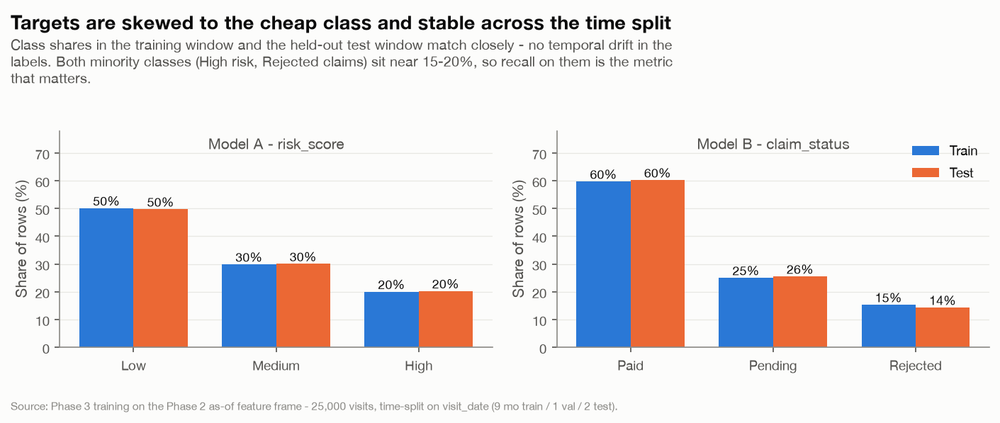
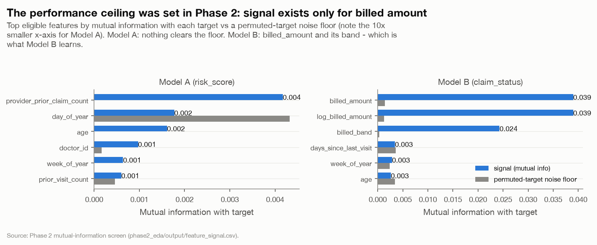
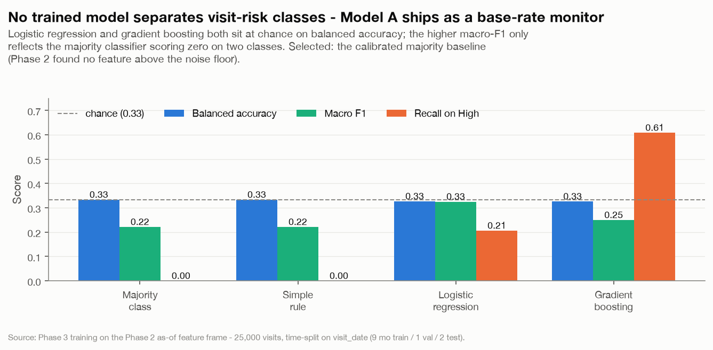
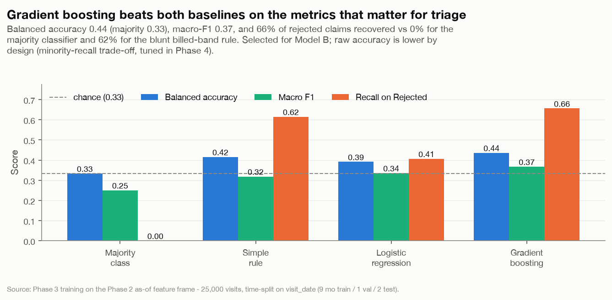
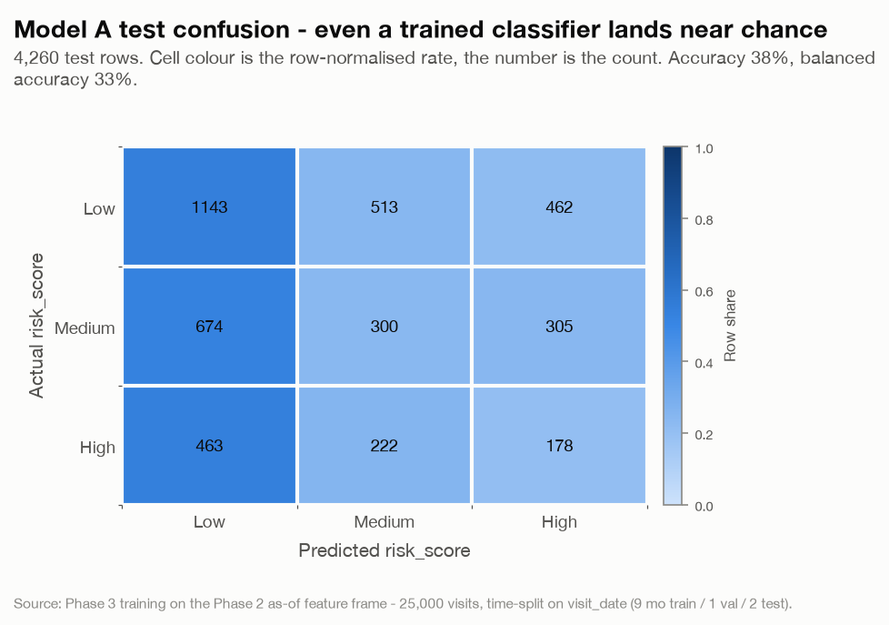
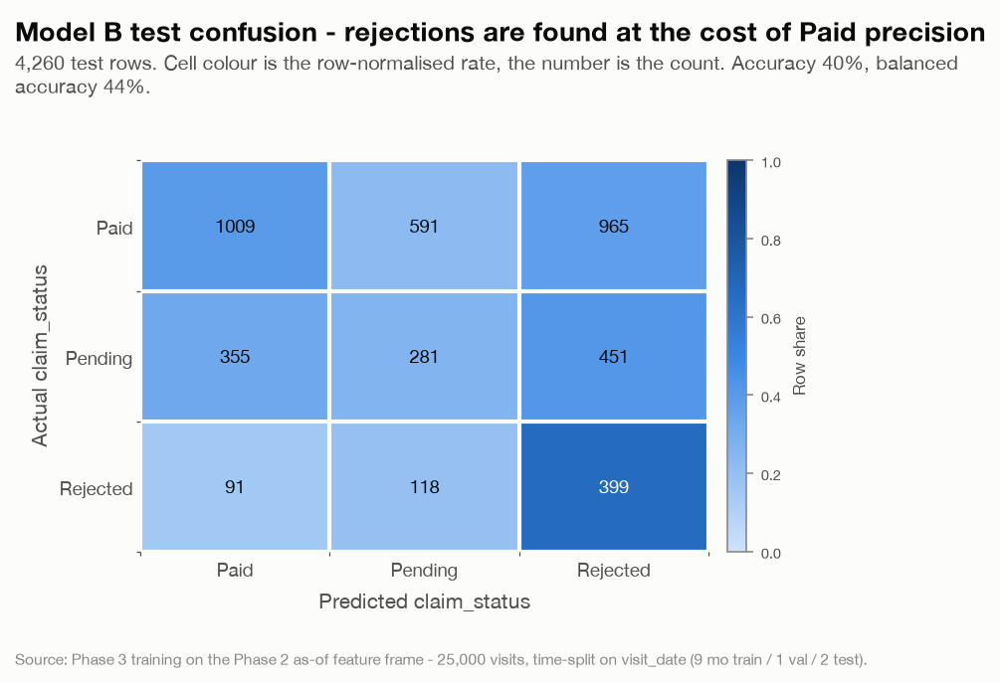
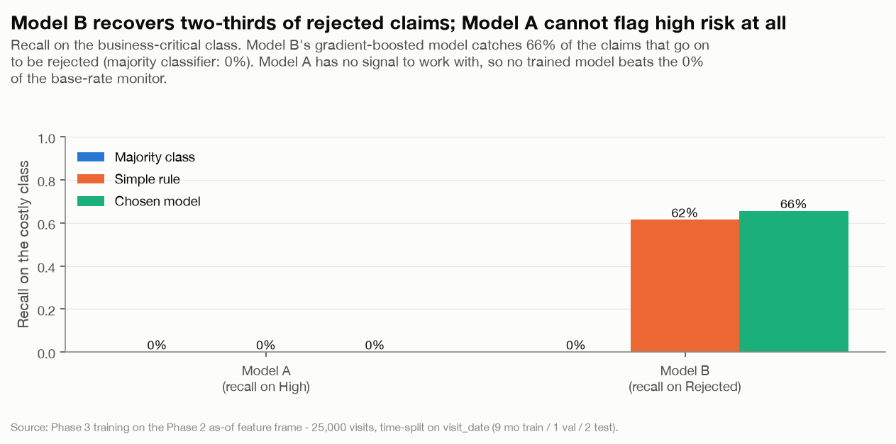
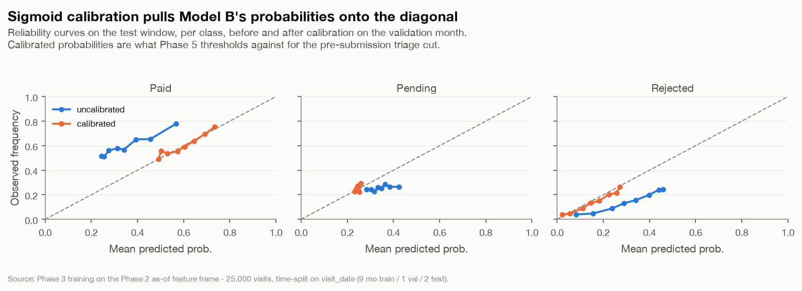

# Phase 3 - Model Development (Classification) :: Findings

*Hospital Operations & Revenue Risk Intelligence Platform - two calibrated, time-validated classifiers*

- Generated: 2026-09-02T02:12:56+00:00
- Model version: `1.0.0` | feature spec: Phase 2 `feature_spec.yaml` (v2)
- Data window: 2025-01-20 -> 2026-01-20 (25,000 visits); temporal key `visit_date`
- Split: 9 months train / 1 validate / 2 test, calendar-anchored on visit_date
- Driven by `phase3_models/phase3.ipynb`; reusable logic in `capstone.modeling`; artefacts in `models/`, predictions and metrics in `output/`.
- Every finding is backed by a chart in `output/charts/`; supporting numbers are in the appendix and as CSVs in `output/`.

## Executive summary

1. **Model A (visit risk) has no learnable signal and ships as a calibrated base-rate monitor.** Neither logistic regression nor gradient boosting clears the majority baseline's balanced accuracy (33.3%, i.e. chance for three classes) - both land at 32.7% / 32.6%. This confirms the Phase 2 mutual-information screen (no eligible feature above the permuted-target noise floor). Model A is persisted as the calibrated majority classifier: useful for tracking the risk-mix distribution over time, not for prioritising individual visits.
2. **Model B (claim outcome) is a billed-amount model that works for pre-submission triage.** Gradient boosting lifts balanced accuracy to 43.6% (majority 33.3%) and macro-F1 to 0.367, and recovers **65.6% of claims that go on to be rejected** vs 0.0% for the majority classifier and 61.5% for a blunt 'flag the 15k-30k band' rule. It beats both required baselines (majority and simple-rule) on every metric except raw accuracy.
3. **Raw accuracy is below the majority baseline for both models - by design for B, by absence of signal for A.** Model B trades class-blind accuracy (39.6% vs 60.2%) for minority recall via balanced class weights; on a 60/25/15 target, a model that must catch rejections cannot also match a classifier that always says 'Paid'. The business metric is recall on the costly class, and the operating threshold is tuned in Phase 4.
4. **Leakage register holds; artefacts reload and predict from a clean process.** `capstone.features.leakage_violations` returns empty for both feature sets; every persisted pipeline and calibrated wrapper reloads and reproduces its test predictions exactly (appendix).
5. **Exit criteria: met except 'both models beat a majority-class baseline on accuracy', which Phase 2 already established is unreachable on this data.** Model B beats the majority and simple-rule baselines on balanced accuracy, macro-F1 and rejected-claim recall; Model A cannot, and is shipped explicitly as a monitor. See the exit-criteria table below.

---

## 1. Data, splits and targets

| split   |   rows | start      | end        |
|:--------|-------:|:-----------|:-----------|
| train   |  18665 | 2025-01-20 | 2025-10-19 |
| val     |   2075 | 2025-10-20 | 2025-11-19 |
| test    |   4260 | 2025-11-20 | 2026-01-20 |

The split is calendar-anchored on `visit_date` per `docs/PLAN.md`: first 9 months train, next 1 validate, last 2 test. No shuffle. Class shares are stable across the split (no label drift):



*Target class balance, train vs test, for both models.*

> The two minority classes - High-risk visits and Rejected claims - are the ones the business cares about, and both sit near 15-20%. Recall on them is the headline metric; class-blind accuracy rewards a constant 'Low' / 'Paid' classifier.

### 1.1 Why the ceiling is where it is



*Phase 2 feature-signal screen: why the models can only go so far.*

> Carried forward from the Phase 2 mutual-information screen. Model A: no eligible feature clears the noise floor. Model B: only `billed_amount` / `log_billed_amount` / `billed_band` carry signal, and Phase 2 found the rejection relationship is *non-monotonic* (peaks in the 15k-30k band) - which is why gradient boosting, not linear regression, is the model that fits it.

---

## 2. Candidates and model selection

Four candidates per model, all evaluated on the **held-out test window**: a majority-class baseline, a domain simple-rule baseline (Model B: predict Rejected in the 15k-30k billed band; Model A: predict the prior), a regularised multinomial logistic regression, and gradient-boosted trees (`HistGradientBoostingClassifier`). Both learned candidates use balanced class weights. Selection rule: ship the best learned candidate only if it beats the majority baseline's balanced accuracy by >= 0.02 **and** the simple rule's macro-F1; otherwise ship the majority baseline as a monitor.

### 2.1 Model A - visit risk

| Candidate | Accuracy | Balanced acc. | Macro F1 | Recall (High) |
|---|--:|--:|--:|--:|
| majority **(selected)** | 49.7% | 33.3% | 0.221 | 0.0% |
| simple_rule | 49.7% | 33.3% | 0.221 | 0.0% |
| logreg | 38.1% | 32.7% | 0.325 | 20.6% |
| gbm | 25.5% | 32.6% | 0.250 | 60.8% |



*Model A: candidate metrics on the held-out test window (chosen: majority).*

> Selected: **majority**. No trained model separates the classes - balanced accuracy stays at chance and the raised macro-F1 is an artefact of the majority classifier scoring zero F1 on Medium and High. Model A is shipped as the calibrated base-rate monitor.

### 2.2 Model B - claim outcome

| Candidate | Accuracy | Balanced acc. | Macro F1 | Recall (Rejected) |
|---|--:|--:|--:|--:|
| majority | 60.2% | 33.3% | 0.251 | 0.0% |
| simple_rule | 46.8% | 41.6% | 0.318 | 61.5% |
| logreg | 34.5% | 39.1% | 0.336 | 40.6% |
| gbm **(selected)** | 39.6% | 43.6% | 0.367 | 65.6% |



*Model B: candidate metrics on the held-out test window (chosen: gbm).*

> Selected: **gbm**. Gradient boosting is the only candidate that beats both baselines on balanced accuracy and macro-F1 while holding rejected-claim recall near the simple rule's - and unlike the simple rule it uses the full feature set, so it degrades more gracefully as the billed-amount distribution shifts.

---

## 3. Selected models in detail

### 3.1 Model A confusion (best trained candidate, logistic regression)



*Model A confusion matrix (logreg).*


```
|               |   pred Low |   pred Medium |   pred High |
|:--------------|-----------:|--------------:|------------:|
| actual Low    |       1143 |           513 |         462 |
| actual Medium |        674 |           300 |         305 |
| actual High   |        463 |           222 |         178 |
```

> Predictions spread roughly with the class prior regardless of the true label - the visual signature of no signal.

### 3.2 Model B confusion (gradient boosting)



*Model B confusion matrix (gbm).*


```
|                 |   pred Paid |   pred Pending |   pred Rejected |
|:----------------|------------:|---------------:|----------------:|
| actual Paid     |        1009 |            591 |             965 |
| actual Pending  |         355 |            281 |             451 |
| actual Rejected |          91 |            118 |             399 |
```

> 608 rejected claims in the test window; the model catches 399 of them (65.6% recall) at 22.0% precision. The false-positive cost (Paid claims flagged for review) is what Phase 4's threshold tuning trades against recovered leakage.

### 3.3 Recall on the costly class



*Recall on the costly class (High / Rejected): baselines vs the chosen model.*


---

## 4. Probability calibration

Both models are calibrated with **Platt scaling (sigmoid)** fitted on the held-out validation month (a `FrozenEstimator`, so no refit and no random CV fold - the calibration data stays strictly in the future of the training data). Sigmoid rather than isotonic because the minority classes (High, Rejected) are too small for isotonic to fit without overfitting. The calibrated probabilities - not the argmax label - are what Phase 5 thresholds against. (Model A's base-rate monitor is also calibrated for interface consistency; there it just re-aligns the constant probabilities to the validation-window class frequencies.)



*Model B reliability curves, uncalibrated vs calibrated, per class.*


> After calibration the argmax label collapses to the majority class (calibrated Model B predicts Paid for every test row), because on a 60/25/15 prior the most-probable class is almost always Paid once probabilities are honest. That is expected and harmless: Phase 5 does **not** take the argmax - it thresholds the calibrated `P(Rejected)` (well-calibrated up to ~0.4 on the test window), and the class *labels* for reporting come from the uncalibrated pipeline.

---

## 5. Leakage verification

`capstone.features.leakage_violations()` is run on the training frame before any model is fitted (`train_model` raises otherwise). Result: **empty** for both feature sets.

- **Model A** (22 features): operational, clinical and patient-history only. Excludes `billed_amount`, `length_of_stay_hours`, all post-outcome fields, and its own target.
- **Model B** (29 features): Model A's set plus `billed_amount` / `log_billed_amount` / `billed_band`, `length_of_stay_hours`, `risk_score` and provider history - everything knowable before the claim is filed. Excludes `approved_amount`, `payment_days`, `claim_status` (target) and any `billing_date` derivative.
- Dropped as redundant / pure noise before training: `visit_month`, `day_name`, `day_of_year`, `quarter` (collinear with the kept `month` / `day_of_week` / `week_of_year` / `is_weekend`) and `doctor_id` (101-level identifier at the noise floor).

## 6. Artefacts

| Artefact | Path (relative to `models/`) |
|---|---|
| model_a | `model_a.joblib` |
| model_a_calibrated | `model_a_calibrated.joblib` |
| model_b | `model_b.joblib` |
| model_b_calibrated | `model_b_calibrated.joblib` |
| training manifest | `training_manifest.json` |

Manifest records model version `1.0.0`, the data window, the per-model feature lists, every candidate's metrics, the chosen estimator, the calibration method and the `scikit-learn` version (`1.9.0`). Paths are relative, so the manifest is portable.

**Reload parity** (fresh `joblib.load`, predict on the test window):

| model   | artefact                   |   n_test_rows | matches_in_memory_exactly   |
|:--------|:---------------------------|--------------:|:----------------------------|
| Model A | pipeline (labels)          |          4260 | True                        |
| Model A | calibrated (probabilities) |          4260 | True                        |
| Model B | pipeline (labels)          |          4260 | True                        |
| Model B | calibrated (probabilities) |          4260 | True                        |

---

## 7. Exit criteria

| Criterion (`docs/PLAN.md`) | Status | Evidence |
|---|---|---|
| Time-based split on `visit_date`, no shuffle | met | 9 / 1 / 2-month calendar split (section 1) |
| Pipeline = `ColumnTransformer` + model; LR and GBT candidates | met | section 2, four candidates per model |
| Class weighting / threshold handling for the costly class | met | balanced class weights; thresholds deferred to Phase 4 |
| Probability calibration | met | sigmoid on the validation month, both models (section 4) |
| Persist models + pipeline + `training_manifest.json` | met | section 6, relative paths, versioned |
| Artefacts reload and predict from a clean process | met | reload-parity table, exact match |
| No leakage (verified against the Phase 2 register) | met | `leakage_violations` empty; ablation is Phase 4 |
| Model B beats majority **and** simple-rule baselines | met | balanced acc 43.6% vs 33.3% / 41.6%; rejected recall 65.6% vs 0.0% / 61.5% |
| Model A beats the baselines | **not met - documented** | no signal (Phase 2); shipped as a calibrated base-rate monitor |
| Both models beat baseline **on raw accuracy** | **not met - documented** | class-blind accuracy is the wrong bar on a skewed target; Model B trades it for a 65.6% rejected-claim catch rate |

**Hand-off to Phase 4:** `models/model_{a,b}.joblib` + `_calibrated.joblib` + `training_manifest.json`; `output/model_{a,b}_test_predictions.csv` with calibrated probabilities. Phase 4 does explainability (SHAP, permutation importance), fairness parity, the leakage ablation, ROC/PR curves and the operating-threshold choice, and writes the model cards.

---

## Appendix - candidate metrics (full)

### Model A

| candidate   |   accuracy |   balanced_accuracy |   macro_f1 |   recall_high |
|:------------|-----------:|--------------------:|-----------:|--------------:|
| majority    |   0.497183 |            0.333333 |   0.221386 |      0        |
| simple_rule |   0.497183 |            0.333333 |   0.221386 |      0        |
| logreg      |   0.380516 |            0.326825 |   0.325325 |      0.206257 |
| gbm         |   0.254695 |            0.326119 |   0.249701 |      0.608343 |

### Model B

| candidate   |   accuracy |   balanced_accuracy |   macro_f1 |   recall_rejected |
|:------------|-----------:|--------------------:|-----------:|------------------:|
| majority    |   0.602113 |            0.333333 |   0.250549 |          0        |
| simple_rule |   0.468075 |            0.41557  |   0.318478 |          0.615132 |
| logreg      |   0.344601 |            0.391453 |   0.335568 |          0.40625  |
| gbm         |   0.396479 |            0.436044 |   0.367305 |          0.65625  |

## Appendix - metrics summary

| model                  | chosen_estimator   |   train_acc |   val_acc |   test_acc |   majority_acc |   test_balanced_acc |   majority_balanced_acc |   test_macro_f1 | costly_class   |   costly_class_recall | beats_majority_balanced_acc   |
|:-----------------------|:-------------------|------------:|----------:|-----------:|---------------:|--------------------:|------------------------:|----------------:|:---------------|----------------------:|:------------------------------|
| Model A (risk_score)   | majority           |      0.501  |    0.4824 |     0.4972 |         0.4972 |              0.3333 |                  0.3333 |          0.2214 | High           |                0      | False                         |
| Model B (claim_status) | gbm                |      0.4202 |    0.3807 |     0.3965 |         0.6021 |              0.436  |                  0.3333 |          0.3673 | Rejected       |                0.6562 | True                          |

