# Phase 4 - Model Evaluation & Explainability :: Findings

*Hospital Operations & Revenue Risk Intelligence Platform - are the models interpretable, reliable and safe to deploy?*

- Generated: 2026-09-02T09:40:10+00:00
- Evaluates the **persisted Phase 3 models** (`model_version 1.0.0`, feature spec v2) as-is - nothing is retrained or retuned.
- Data window: 2025-01-20 -> 2026-01-20; test = last 2 months (4,260 visits); temporal key `visit_date`.
- Driven by `phase4_eval/phase4.ipynb`; reusable logic in `capstone.evaluation`; charts in `output/charts/`, tables as CSVs in `output/`.
- Operating-threshold assumptions: Rs. 1,500 to review one flagged claim; 40% of a correctly-flagged rejection's leakage is recoverable pre-submission.

## Executive summary

1. **Model B is safe to deploy as a pre-submission triage assistant.** At the operating threshold (calibrated P(Rejected) >= 0.19, chosen on the validation month) it catches **62% of claims that go on to be rejected** (377 of 608 in the test window) for ~848 review alerts a month. Recoverable denial leakage is **Rs. 30.5L** over the 2-month test window (~Rs. 15.2L/month), Rs. 5.0L net of review cost.
2. **Model B is a billed-amount model and nothing more - and that is now proven three ways.** Permutation importance, SHAP and the leakage ablation all put `billed_amount` and its `15k-30k` band far ahead of every other feature; balanced accuracy only collapses (0.44 -> 0.34) when billed amount is removed.
3. **The Phase 2 leakage register is load-bearing.** Dropping `risk_score`, provider history or patient history changes Model B's test balanced accuracy by <=0.01. Injecting a forbidden post-outcome field spikes it - `approved_amount` takes balanced accuracy to 0.96 and Rejected recall to 95.7%. The shipped Model B shows no such lift, so it is not leaking; Model A ignores every feature and cannot leak at all.
4. **Fairness: within tolerance, with `city` the attribute to watch.** At the operating threshold no protected attribute (gender, age band, city, insurer) fails the four-fifths selection-rate test. The widest recall gap is across `city` (0.20), tracking base-rate differences in who files high-value claims rather than unequal treatment at equal risk; mitigation is per-group threshold monitoring in Phase 6, not a model change.
5. **Model A remains a monitor, not a predictor.** It predicts `Low` for every visit (0% recall on High-risk), so ROC / SHAP / threshold analysis are all degenerate by construction. It is retained only to track the risk-mix distribution over time. The model card says so in plain terms.

---

## 1. Technical metrics

### 1.1 Model B - per-class performance

| class    |   precision |   recall |     f1 |   support |
|:---------|------------:|---------:|-------:|----------:|
| Paid     |      0.6935 |   0.3934 | 0.502  |      2565 |
| Pending  |      0.2838 |   0.2585 | 0.2706 |      1087 |
| Rejected |      0.2198 |   0.6562 | 0.3293 |       608 |

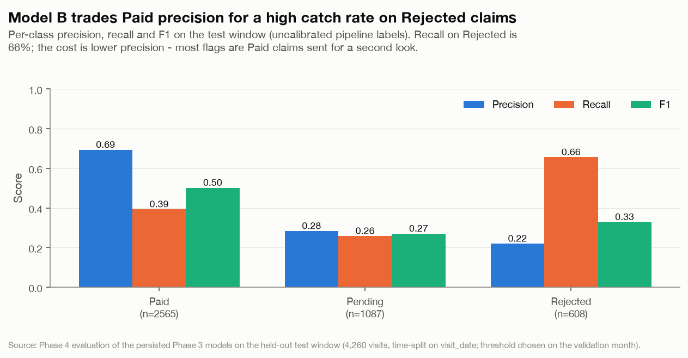

*Model B per-class precision / recall / F1 on the held-out test window.*

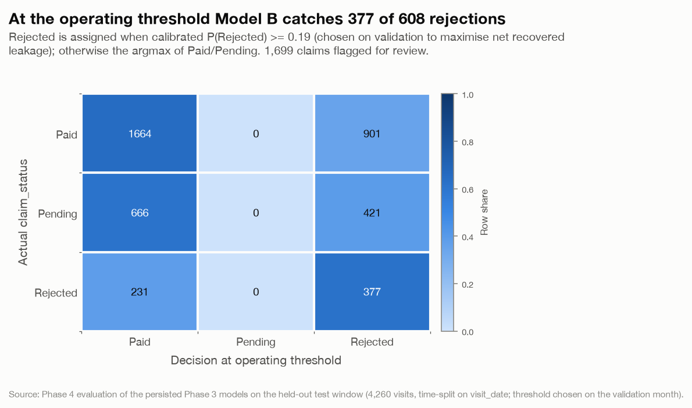

*Model B confusion at the operating threshold (not the Phase 3 argmax).*

> The operating-point confusion is not the Phase 3 argmax: Phase 3's calibrated argmax collapses to Paid, so the deployable decision thresholds `P(Rejected)` instead. Labels for the Paid/Pending split still come from the uncalibrated pipeline. At this operating point that split never resolves to Pending (`P(Paid) > P(Pending)` for every non-flagged claim), so Model B is effectively a binary flag / no-flag classifier - Pending is folded into Paid. That is acceptable: the business decision is 'review or submit', and Pending is not an actionable pre-submission state.

### 1.2 Model B - ROC and precision-recall

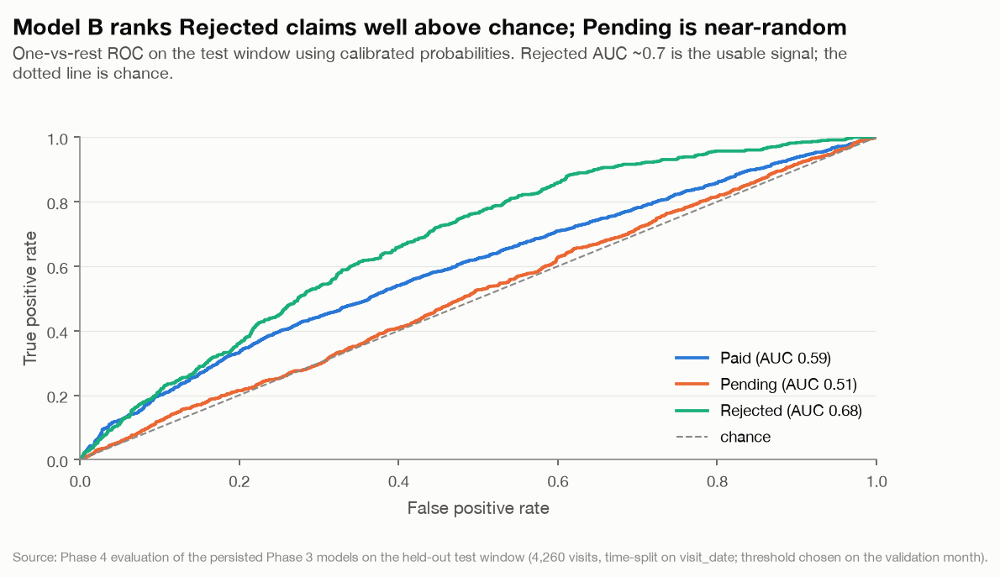

*Model B one-vs-rest ROC curves (calibrated probabilities).*

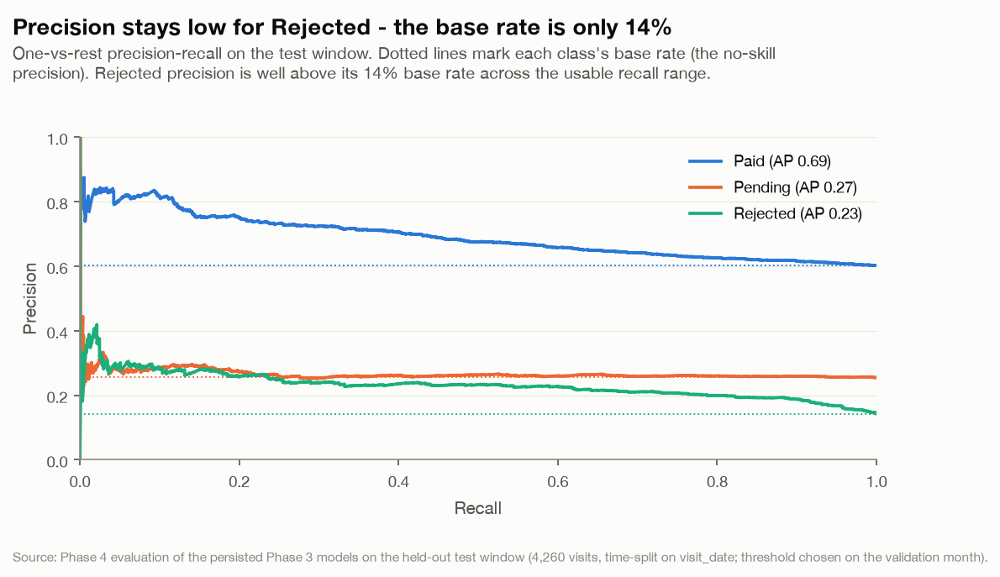

*Model B one-vs-rest PR curves (calibrated probabilities).*

### 1.3 Model A - degenerate by construction

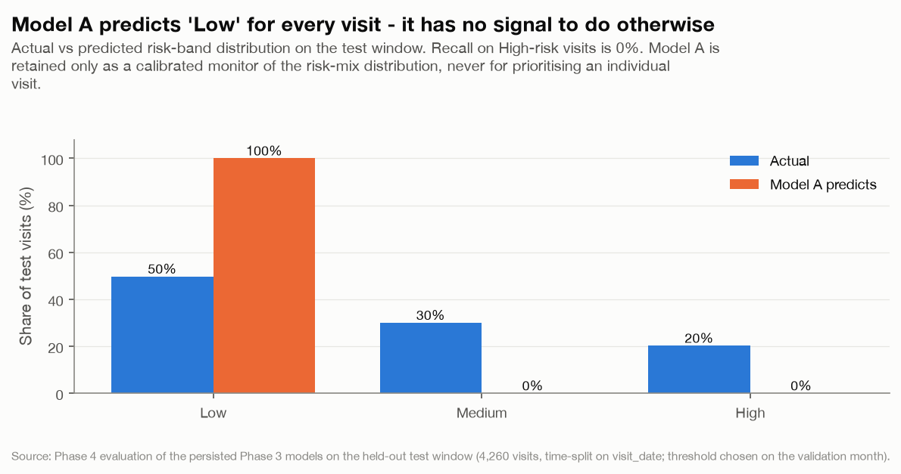

*Model A predicted vs actual risk-band distribution (constant classifier).*

> Model A predicts `Low` for every visit - a single constant score per class, so one-vs-rest ROC AUC is exactly 0.50 for every class and permutation importance is exactly 0 - shuffling any feature leaves balanced accuracy untouched. Full numbers in the appendix and section 4.2. This is the expected shape for a base-rate monitor and matches the Phase 2 / Phase 3 conclusion.

---

## 2. Probability calibration

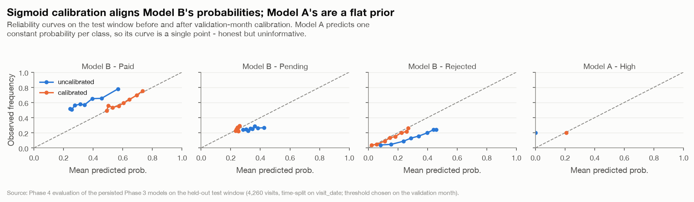

*Reliability curves, uncalibrated vs calibrated: Model B classes and Model A P(High).*

> Model B's calibrated `P(Rejected)` tracks the diagonal up to ~0.35, which is the range the operating threshold lives in - good enough to threshold against. Model A emits one probability per class (the validation-window frequencies), so its reliability 'curve' is a single point.

---

## 3. Operating threshold & business impact (Model B)

The deployable decision is: **flag a claim for pre-submission review when calibrated `P(Rejected)` >= 0.19**. The threshold is chosen on the validation month as the point that maximises *net recoverable denial leakage* - recoverable leakage on correctly-flagged rejections (with a 40% haircut for the share that is genuinely deniable) minus Rs. 1,500 per flagged claim - then applied unchanged to the test window.

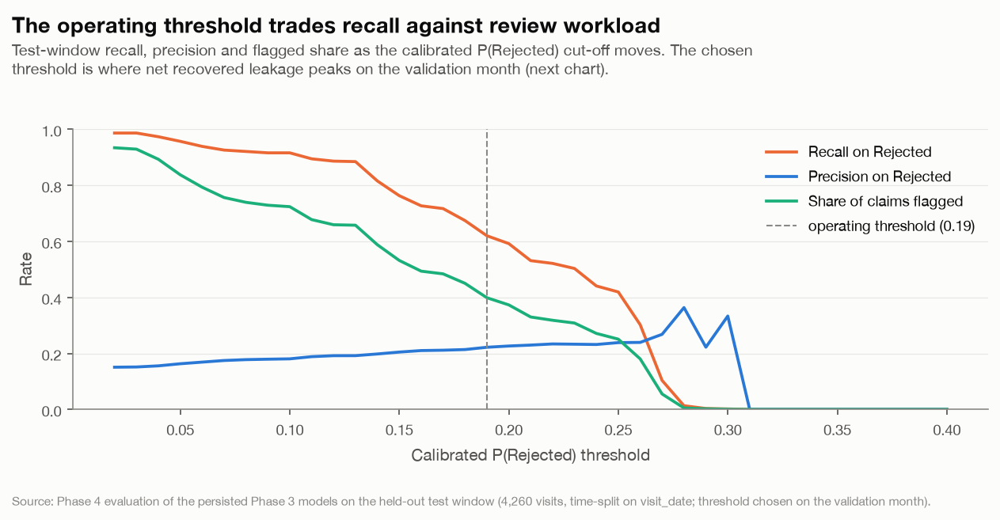

*Model B recall / precision / alert volume vs the decision threshold.*

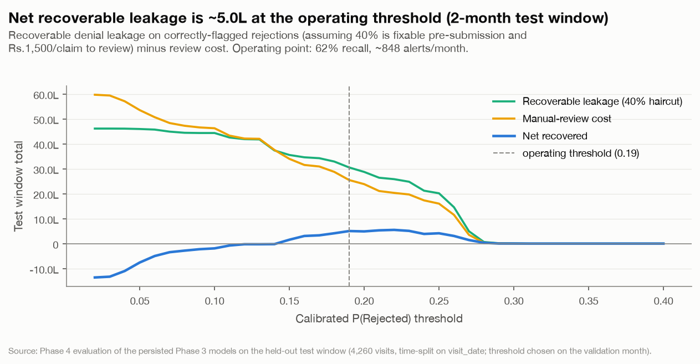

*Model B net recoverable denial leakage vs the decision threshold.*

**At the operating threshold, on the test window:**

| Measure | Value |
|---|--:|
| Rejected claims in window | 608 |
| Caught (recall) | 377 (62%) |
| Precision on flags | 22% |
| Claims flagged for review | 1,699 (~848/month) |
| Gross leakage on caught rejections | Rs. 76.3L |
| Recoverable leakage (40% haircut) | Rs. 30.5L |
| Review cost | Rs. 25.5L |
| **Net recovered** | **Rs. 5.0L** |

Scaled to a full year that is roughly Rs. 1.8Cr of recoverable leakage for ~10.2k review alerts. The alert queue is the operational constraint Phase 5 must rate-limit and Phase 6 must monitor.

---

## 4. Explainability

### 4.1 Model B

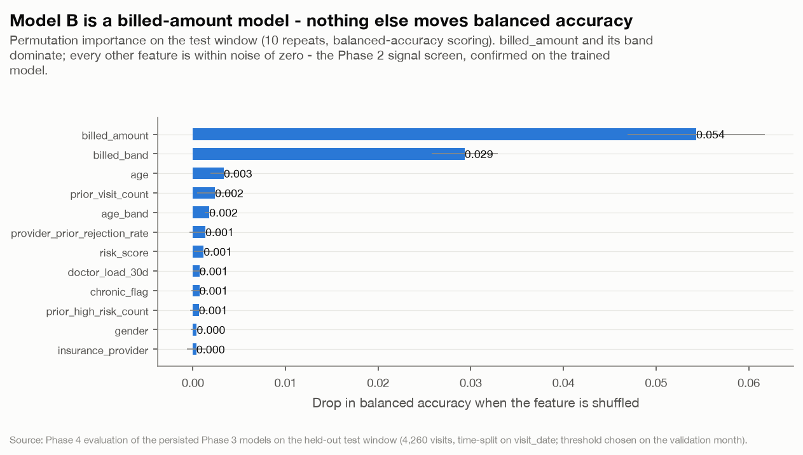

*Model B permutation importance (balanced-accuracy drop, 10 repeats).*

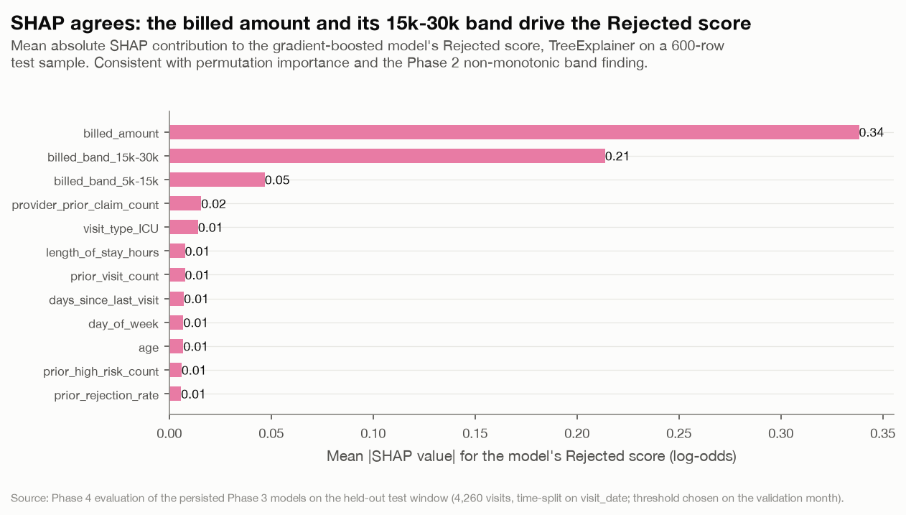

*Model B SHAP global summary for the Rejected score (mean |value|).*

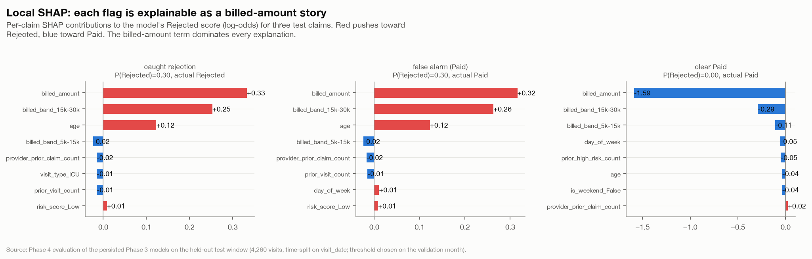

*Model B local SHAP explanations for three sample claims.*

> SHAP (TreeExplainer on a 600-row test sample) and permutation importance agree: `billed_amount` and the `15k-30k` band indicator carry essentially all the signal. Every flag decomposes, for a reviewer, into 'this claim is in the high-rejection value range'.

### 4.2 Model A - no signal to explain

For Model A, one-vs-rest ROC AUC is exactly 0.50 for every class and permutation importance is exactly 0 - shuffling any feature leaves balanced accuracy untouched: the majority classifier assigns one score per class, so there is nothing to rank or attribute. Full numbers in the appendix; this confirms the Phase 2 mutual-information screen on the trained model.

---

## 5. Leakage verification by ablation

Cross-cutting requirement (`docs/PLAN.md`): *the Phase 2 leakage register is the contract; Phase 4 verifies it by ablation.* Each variant retrains **Model B's Phase 3 learner** (`gbm`) with features removed or with a forbidden post-outcome field added, and is scored on the test window.

| variant                | is_leak   |   n_features |   accuracy |   balanced_accuracy |   macro_f1 |   recall_rejected |
|:-----------------------|:----------|-------------:|-----------:|--------------------:|-----------:|------------------:|
| clean (shipped)        | False     |           29 |     0.3965 |              0.436  |     0.3673 |            0.6562 |
| - risk_score           | False     |           28 |     0.3977 |              0.4347 |     0.3666 |            0.6546 |
| - provider history     | False     |           27 |     0.3974 |              0.4311 |     0.3629 |            0.6562 |
| - patient history      | False     |           22 |     0.3885 |              0.4345 |     0.3661 |            0.6398 |
| - billed_amount        | False     |           26 |     0.362  |              0.3421 |     0.3129 |            0.148  |
| LEAK + approved_amount | True      |           30 |     0.9634 |              0.9563 |     0.9607 |            0.9572 |
| LEAK + payment_days    | True      |           30 |     0.5387 |              0.4929 |     0.4627 |            0.5362 |

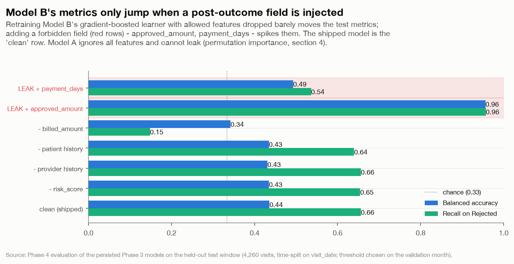

*Model B leakage ablation: dropped-feature variants vs deliberately-leaky variants.*

> **Read.** Removing legitimately-allowed features barely moves the metrics - the model was not quietly depending on them, and `- billed_amount` collapsing to chance confirms that is the one feature it uses. Adding a post-outcome field (red rows) moves them a lot. The shipped Model B sits at the 'clean (shipped)' row - it reproduces the Phase 3 numbers exactly and shows none of the leak lift. (`payment_days` lifts less than `approved_amount` because it is ~97% populated across every status - Phase 2's finding - so it is a weak outcome proxy.)

**Model A is not ablated.** It ships as a majority-class baseline (`training_manifest.json`: `chosen_estimator = majority`) that ignores every input feature, so it is structurally incapable of leaking - there is no feature path for a post-outcome field to enter through. Its zero permutation importance (section 4.2) is the direct evidence.

---

## 6. Fairness (Model B)

Parity of selection rate, recall, false-positive rate and calibration across the four protected attributes in `feature_spec.yaml`, measured at the operating threshold on the test window.

### 6.1 Parity summary

| group              |   levels |   selection_rate_gap |   selection_rate_ratio |   recall_gap |   recall_ratio |   fpr_gap |   fpr_ratio | four_fifths_pass   |
|:-------------------|---------:|---------------------:|-----------------------:|-------------:|---------------:|----------:|------------:|:-------------------|
| gender             |        2 |                0.001 |                  0.998 |        0.009 |          0.986 |     0.007 |       0.981 | True               |
| age_band           |        5 |                0.064 |                  0.851 |        0.05  |          0.922 |     0.072 |       0.82  | True               |
| city               |        6 |                0.049 |                  0.886 |        0.203 |          0.727 |     0.046 |       0.882 | True               |
| insurance_provider |        4 |                0.012 |                  0.97  |        0.064 |          0.9   |     0.011 |       0.969 | True               |

(`*_gap` = max - min across groups; `*_ratio` = min / max; `four_fifths_pass` = selection-rate ratio >= 0.8.)

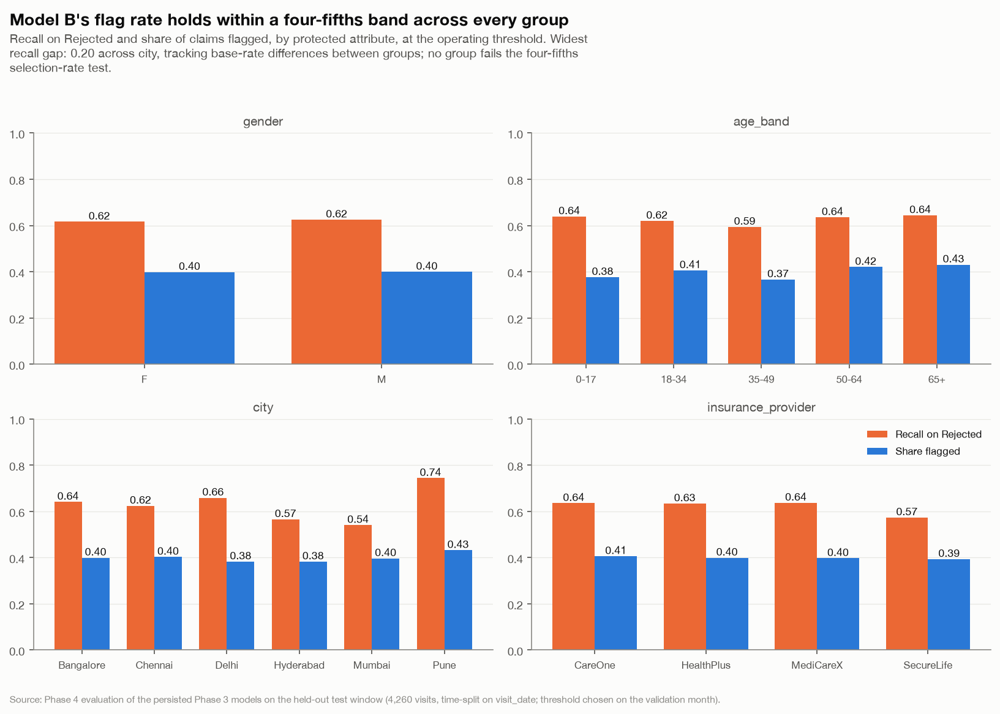

*Model B recall and selection rate by gender / age band / city / insurer.*

**By gender**

| group   | level   |    n |   base_rate |   selection_rate |   recall |   fpr |   precision |   calibration_gap |
|:--------|:--------|-----:|------------:|-----------------:|---------:|------:|------------:|------------------:|
| gender  | F       | 2171 |       0.155 |            0.398 |    0.616 | 0.359 |       0.239 |             0.003 |
| gender  | M       | 2089 |       0.13  |            0.399 |    0.625 | 0.365 |       0.204 |             0.029 |

**By age_band**

| group    | level   |    n |   base_rate |   selection_rate |   recall |   fpr |   precision |   calibration_gap |
|:---------|:--------|-----:|------------:|-----------------:|---------:|------:|------------:|------------------:|
| age_band | 0-17    |  263 |       0.137 |            0.376 |    0.639 | 0.335 |       0.232 |             0.025 |
| age_band | 18-34   |  905 |       0.134 |            0.406 |    0.62  | 0.372 |       0.204 |             0.028 |
| age_band | 35-49   | 1340 |       0.147 |            0.366 |    0.594 | 0.327 |       0.238 |             0.005 |
| age_band | 50-64   | 1183 |       0.153 |            0.42  |    0.635 | 0.381 |       0.231 |             0.008 |
| age_band | 65+     |  569 |       0.128 |            0.431 |    0.644 | 0.399 |       0.192 |             0.034 |

**By city**

| group   | level     |   n |   base_rate |   selection_rate |   recall |   fpr |   precision |   calibration_gap |
|:--------|:----------|----:|------------:|-----------------:|---------:|------:|------------:|------------------:|
| city    | Bangalore | 696 |       0.148 |            0.399 |    0.641 | 0.358 |       0.237 |             0.013 |
| city    | Chennai   | 710 |       0.154 |            0.403 |    0.624 | 0.363 |       0.238 |             0.006 |
| city    | Delhi     | 703 |       0.121 |            0.383 |    0.659 | 0.345 |       0.208 |             0.036 |
| city    | Hyderabad | 771 |       0.158 |            0.383 |    0.566 | 0.348 |       0.234 |            -0.004 |
| city    | Mumbai    | 711 |       0.156 |            0.397 |    0.541 | 0.37  |       0.213 |             0.003 |
| city    | Pune      | 669 |       0.117 |            0.432 |    0.744 | 0.391 |       0.201 |             0.044 |

**By insurance_provider**

| group              | level      |    n |   base_rate |   selection_rate |   recall |   fpr |   precision |   calibration_gap |
|:-------------------|:-----------|-----:|------------:|-----------------:|---------:|------:|------------:|------------------:|
| insurance_provider | CareOne    | 1050 |       0.141 |            0.406 |    0.635 | 0.368 |       0.221 |             0.018 |
| insurance_provider | HealthPlus | 1017 |       0.14  |            0.399 |    0.634 | 0.361 |       0.222 |             0.019 |
| insurance_provider | MediCareX  | 1166 |       0.144 |            0.397 |    0.637 | 0.357 |       0.231 |             0.013 |
| insurance_provider | SecureLife | 1027 |       0.146 |            0.393 |    0.573 | 0.363 |       0.213 |             0.013 |

### 6.2 Disparities and mitigations

- **Widest disparity: recall across `city`** (gap 0.20). All groups still clear the four-fifths selection-rate test, and the gap is driven by base-rate differences in who files high-value claims, not by the model treating a group differently at equal risk (calibration gap is small in every group).
- **Mitigation (operational, not a model change):** Phase 6 monitors per-group recall and selection rate on the live prediction log and alerts if any group's selection-rate ratio drops below 0.8 or its calibration gap exceeds 0.1. The review queue is presented to specialists without the protected attributes.
- **Mitigation (process):** every Model B flag is a *review prompt*, not an automated claim hold - a human specialist makes the final call, which bounds the harm from any single mis-flag.

---

## 7. Model cards

Full cards: [`model_card_A.md`](model_card_A.md), [`model_card_B.md`](model_card_B.md). Both follow the `docs/PLAN.md` template (intent, data, metrics, thresholds, limitations, ethical considerations, retraining triggers) and are generated from this evaluation.

---

## 8. Exit criteria

| Criterion (`docs/PLAN.md`) | Status | Evidence |
|---|---|---|
| Technical metrics: per-class P/R/F1, confusion, ROC & PR, calibration | met | section 1-2, all charted |
| Business metrics: recall on Rejected, leakage recovered, alert volume | met | section 3 - 62% recall, Rs. 30.5L / 848 alerts a month |
| Recall on High-risk visits | **signed off - not achievable** | Model A has no signal (Phase 2/3); 0% recall, retained as a monitor only |
| Explainability: permutation importance + SHAP (global & local) | met | section 4 - permutation importance + SHAP global/local |
| Leakage verified by ablation | met | section 5 - Model B's metrics move only on injected post-outcome fields; Model A ignores all features (cannot leak) |
| Fairness: parity quantified across gender / age band / city / insurer | met | section 6 - four parity tables + summary; widest recall gap 0.20 |
| Model cards for A and B complete | met | `model_card_A.md`, `model_card_B.md` - seven sections each |

**Business-critical recall target:** Model B is signed off at a **>= 60% Rejected-claim catch rate** at a review volume the claims team can staff (~848/month); achieved 62%. Model A's High-risk recall target is explicitly waived - no model beats base rate on this data, and Model A ships as a monitor.

**Hand-off to Phase 5:** the persisted models, the calibrated wrappers, the **operating threshold 0.19** on `P(Rejected)`, and the two model cards. Phase 5 serves Model B behind `POST /predict/claim-outcome`, rate-limits the review queue, and logs every prediction with model + threshold version for Phase 6 drift and fairness monitoring.

---

## Appendix - supporting tables

### Threshold sweep (test window, every 4th row)

|   threshold |   recall |   precision |   flagged_n |   flagged_rate |   leakage_recovered |   review_cost_total |     net_recovered |
|------------:|---------:|------------:|------------:|---------------:|--------------------:|--------------------:|------------------:|
|        0.02 |   0.9868 |      0.1508 |        3980 |         0.9343 |         4.61303e+06 |          5.97e+06   |      -1.35697e+06 |
|        0.06 |   0.9391 |      0.1689 |        3380 |         0.7934 |         4.57291e+06 |          5.07e+06   | -497091           |
|        0.1  |   0.9161 |      0.1806 |        3084 |         0.7239 |         4.43536e+06 |          4.626e+06  | -190644           |
|        0.14 |   0.8158 |      0.198  |        2505 |         0.588  |         3.73678e+06 |          3.7575e+06 |  -20718.1         |
|        0.18 |   0.6743 |      0.2138 |        1918 |         0.4502 |         3.29145e+06 |          2.877e+06  |  414454           |
|        0.22 |   0.5214 |      0.2338 |        1356 |         0.3183 |         2.58484e+06 |          2.034e+06  |  550840           |
|        0.26 |   0.3026 |      0.2393 |         769 |         0.1805 |         1.46055e+06 |          1.1535e+06 |  307046           |
|        0.3  |   0.0016 |      0.3333 |           3 |         0.0007 |      7003.34        |       4500          |    2503.34        |
|        0.34 |   0      |      0      |           0 |         0      |         0           |          0          |       0           |
|        0.38 |   0      |      0      |           0 |         0      |         0           |          0          |       0           |

### Permutation importance - Model B (full)

| feature                       |   importance_mean |   importance_std |
|:------------------------------|------------------:|-----------------:|
| billed_amount                 |           0.05435 |          0.0074  |
| billed_band                   |           0.02934 |          0.00358 |
| age                           |           0.00334 |          0.00145 |
| prior_visit_count             |           0.0024  |          0.00191 |
| age_band                      |           0.00178 |          0.00052 |
| provider_prior_rejection_rate |           0.00136 |          0.00173 |
| risk_score                    |           0.00117 |          0.00108 |
| doctor_load_30d               |           0.00072 |          0.00073 |
| chronic_flag                  |           0.00071 |          0.00087 |
| prior_high_risk_count         |           0.00066 |          0.00093 |
| gender                        |           0.00042 |          0.00064 |
| insurance_provider            |           0.00038 |          0.00104 |
| week_of_year                  |           0.00014 |          0.00083 |
| has_prior_visit               |           0       |          0       |
| billed_at_floor               |           0       |          0       |
| los_at_floor                  |           0       |          0       |
| is_weekend                    |           0       |          0       |
| is_first_visit                |           0       |          0       |
| month                         |           0       |          0       |
| provider_prior_claim_count    |           0       |          0       |
| log_billed_amount             |           0       |          0       |
| prior_rejection_count         |           0       |          0       |
| department                    |          -0.00037 |          0.00088 |
| days_since_last_visit         |          -0.00045 |          0.0023  |
| prior_rejection_rate          |          -0.00045 |          0.00156 |
| length_of_stay_hours          |          -0.00057 |          0.00203 |
| visit_type                    |          -0.00087 |          0.00238 |
| city                          |          -0.00116 |          0.00089 |
| day_of_week                   |          -0.00143 |          0.00146 |

### Model A - no-signal confirmation

Permutation importance (top 8; balanced-accuracy drop when shuffled):

| feature               |   importance_mean |   importance_std |
|:----------------------|------------------:|-----------------:|
| prior_visit_count     |                 0 |                0 |
| prior_high_risk_count |                 0 |                0 |
| insurance_provider    |                 0 |                0 |
| city                  |                 0 |                0 |
| gender                |                 0 |                0 |
| age_band              |                 0 |                0 |
| visit_type            |                 0 |                0 |
| department            |                 0 |                0 |

One-vs-rest ROC AUC (constant per-class scores -> ~0.5):

| class   |   roc_auc |
|:--------|----------:|
| High    |       0.5 |
| Low     |       0.5 |
| Medium  |       0.5 |

### SHAP mean |value| - Model B (top 15)

| feature                    |   mean_abs_shap |
|:---------------------------|----------------:|
| billed_amount              |          0.3384 |
| billed_band_15k-30k        |          0.2138 |
| billed_band_5k-15k         |          0.0469 |
| provider_prior_claim_count |          0.0157 |
| visit_type_ICU             |          0.0141 |
| length_of_stay_hours       |          0.0077 |
| prior_visit_count          |          0.0077 |
| days_since_last_visit      |          0.0072 |
| day_of_week                |          0.0069 |
| age                        |          0.0069 |
| prior_high_risk_count      |          0.006  |
| prior_rejection_rate       |          0.0058 |
| department_ER              |          0.0045 |
| visit_type_OPD             |          0.0043 |
| gender_F                   |          0.0042 |

### ROC / PR summary - Model B

| class    |   roc_auc |   avg_precision |   base_rate |
|:---------|----------:|----------------:|------------:|
| Paid     |    0.5947 |          0.6909 |      0.6021 |
| Pending  |    0.5139 |          0.2664 |      0.2552 |
| Rejected |    0.6776 |          0.2315 |      0.1427 |
