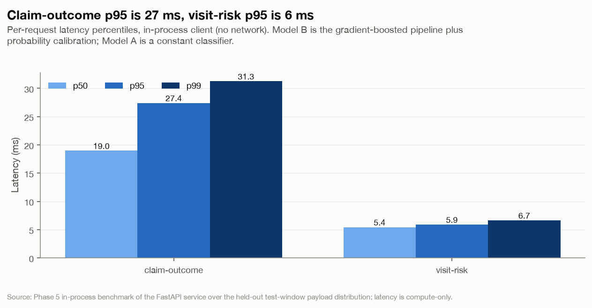
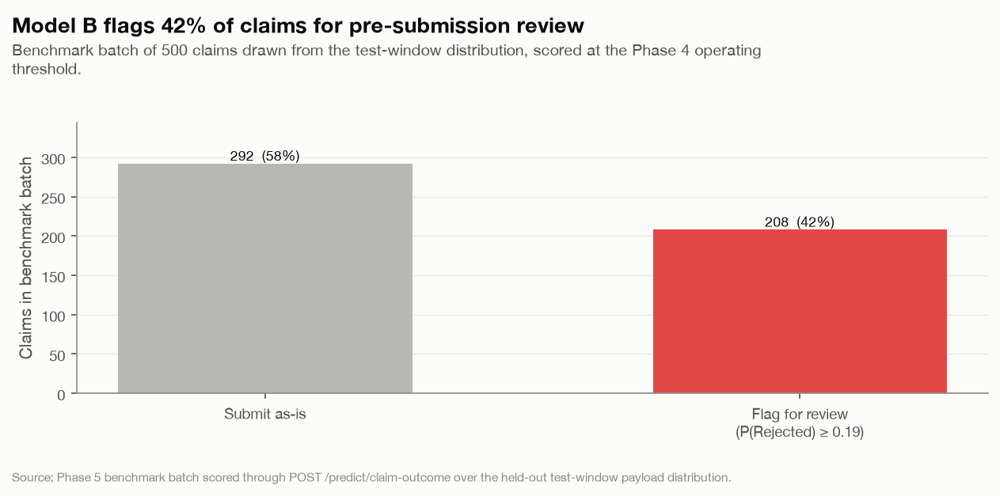

# Phase 5 - Deployment & API Integration (MLOps) :: Findings

*Hospital Operations & Revenue Risk Intelligence Platform - are the Phase 3 models served production-ready, validated, versioned and logged?*

- Generated: 2026-09-02T22:43:39+00:00
- Serves the **persisted Phase 3 models** as-is (`model_version 1.0.0`, feature spec v2) - nothing is retrained. FastAPI + Pydantic v2; `capstone.serving` is the reusable core.
- Model B operating threshold: calibrated `P(Rejected)` >= **0.19** (`threshold_version 1.0.0`, rederived from the Phase 4 net-recovery sweep).
- Benchmarked with an in-process client over the held-out test-window payload distribution; latency is compute-only (no network).

## Executive summary

1. **Both models are served and every response is versioned.** `POST /predict/claim-outcome` (Model B) and `POST /predict/visit-risk` (Model A) return the predicted class, calibrated probabilities and `model_version` / `feature_spec_version`; `/model-info` and `/health` expose readiness. p95 latency is 27.4 ms (claim outcome) and 5.9 ms (visit risk).
2. **The serving path reproduces Phase 3 exactly.** 40 golden Model B cases and 40 Model A cases reconstruct the persisted Phase 3 predictions to <=1e-6 on probability and 0 label mismatches - the API's feature assembly is identical to training (PASS).
3. **Invalid payloads are rejected cleanly.** Every categorical field is bound to its Phase 1 domain and every numeric to its range; a bad request returns `422` with a typed `{"error": "validation_error", "detail": [...]}` body. Model A's schema does not even accept `billed_amount` / `length_of_stay_hours` / `risk_score` - the leakage register enforced at the edge.
4. **Every prediction is logged with version metadata.** `capstone_solution.prediction_log` captures request id, model + versions, probabilities, the review/submit decision, latency and the payload - the Phase 6 drift baseline and the governance audit trail. Logging is best-effort: a DB outage degrades `/health` but never fails a prediction.
5. **`docker compose up` serves the whole thing.** The image bakes in the model artefacts and the serving config; compose stands up Postgres alongside for the prediction log.

---

## 1. Endpoints

| method   | route                  | purpose                                                         |
|:---------|:-----------------------|:----------------------------------------------------------------|
| GET      | /health                | Model + database readiness, uptime                              |
| GET      | /model-info            | Versions, feature counts, thresholds, categorical domains       |
| POST     | /predict/claim-outcome | Model B - pre-submission claim outcome + review/submit decision |
| POST     | /predict/visit-risk    | Model A - visit risk (calibrated base-rate monitor)             |

Interactive docs at `/` (redirects to `/docs`); machine-readable schema at `/openapi.json` (also dumped to `phase5_api/openapi.json`).

## 2. Schema validation & the leakage-safe contract

- **Test suite:** 31 passed, 0 failed (`31 passed, 2 warnings in 2.60s`).
- Categorical domains (`department`, `visit_type`, `gender`, `city`, `insurance_provider`, `risk_score`) are the Phase 1 CHECK-constraint values, served on `/model-info` for client-side validation.
- Numeric guards: `age` 0-120, `billed_amount` >= 0, `length_of_stay_hours` >= 0, history rates in [0, 1], history counts >= 0.
- **Leakage register at the edge:** `VisitRiskRequest` (Model A) has no billing / LOS / `risk_score` field; sending one is a `422`. The serving layer only ever assembles the columns in each model's manifest feature list.
- As-of history aggregates are optional; when omitted the response lists them in `defaults_applied` so the caller knows the estimate assumes no prior history.

## 3. Golden-prediction regression

| model   |   cases |   label mismatches |   max abs prob delta |
|:--------|--------:|-------------------:|---------------------:|
| Model A |      40 |                  0 |                    0 |
| Model B |      40 |                  0 |                    0 |

> Each case is a reconstructed API payload for a held-out test visit paired with its persisted Phase 3 prediction. Zero drift confirms the Phase 5 feature assembly (`capstone.serving.build_model_row`) matches `capstone.features.build_feature_frame` transform-for-transform.

## 4. Latency & throughput

| endpoint               |   n |   p50 |   p95 |   p99 |   mean |   throughput_rps |
|:-----------------------|----:|------:|------:|------:|-------:|-----------------:|
| /predict/claim-outcome | 500 | 18.96 | 27.42 | 31.26 |  20.07 |            37.49 |
| /predict/visit-risk    | 500 |  5.44 |  5.9  |  6.65 |   5.51 |           104.15 |



*Per-request compute latency (p50 / p95 / p99) by prediction endpoint.*

> Compute-only, in-process. Model B is slower than Model A (a 29-feature gradient-boosted pipeline plus calibration vs a 22-feature constant classifier). Both are well inside interactive budgets; the operational constraint is the review-queue volume (Phase 4), not per-call latency.

## 5. What the service decides



*Model B review/submit split on a 500-claim benchmark batch at the operating threshold P(Rejected) >= 0.19.*

- On the benchmark batch (500 claims from the test-window distribution), **208 (42%)** clear `P(Rejected) >= 0.19` and are flagged for pre-submission review - consistent with the ~40% flag rate Phase 4 reported at this threshold.
- Model A returns `Low` for every visit (the base-rate monitor); the response carries the explicit monitor notice from `model_card_A.md`.

## 6. Prediction log (Phase 6 hand-off)

`capstone_solution.prediction_log` - append-only by convention, one row per served prediction:

```
id, ts, request_id, endpoint, model, model_version, feature_spec_version,
serving_version, operating_threshold, predicted_class, probabilities (jsonb),
decision (jsonb), defaults_applied (jsonb), request_payload (jsonb), latency_ms,
client_host
```

| column               | value                  |
|:---------------------|:-----------------------|
| endpoint             | /predict/claim-outcome |
| model                | B                      |
| model_version        | 1.0.0                  |
| feature_spec_version | 2                      |
| serving_version      | 1.0.0                  |
| operating_threshold  | 0.19                   |
| predicted_class      | Paid                   |
| latency_ms           | 18.665                 |

- Logged this run: **yes**.
- Phase 6 reads this table for feature drift (PSI/KS vs the Phase 3 training reference), prediction-distribution drift, per-group fairness on the live stream, and - once adjudicated outcomes land - performance drift.

## 7. Containerisation

- `phase5_api/Dockerfile` - `python:3.12-slim`, `uv sync --frozen`, bakes in `src/capstone`, the Phase 3 `models/`, the Phase 2 feature frame and `serving_config.json`. `CMD` runs `uvicorn app.main:app`.
- `phase5_api/docker-compose.yml` - `postgres:16` + the `api` service; `api` waits on the Postgres healthcheck, points `PGHOST` at the `postgres` service, and applies the `prediction_log` DDL on startup. `docker compose up --build` serves both models on `:8000`.

## 8. Exit criteria

| Criterion (docs/PLAN.md)                 | Status   | Evidence                                                                                                |
|:-----------------------------------------|:---------|:--------------------------------------------------------------------------------------------------------|
| `docker compose up` serves both models   | met      | compose = postgres + api; image bakes in the artefacts; `/health` -> both models loaded                 |
| Invalid payloads rejected cleanly        | met      | typed 422 `validation_error` body; 31 tests incl. every enum/range/leakage case                         |
| Predictions logged with version metadata | met      | `prediction_log` row carries model + model_version + feature_spec_version + serving_version + threshold |
| p95 latency noted                        | met      | claim-outcome 27.4 ms, visit-risk 5.9 ms (compute-only)                                                 |
| Schema / golden / contract tests         | met      | 31 passed; golden regression reproduces Phase 3 to 1e-6                                                 |
| Versioned artefacts echoed in responses  | met      | `model_version` / `feature_spec_version` on every prediction; `/model-info` full detail                 |

**Hand-off to Phase 6:** the running services, `capstone_solution.prediction_log` as the drift baseline, `serving_config.json` (model + threshold versions), and `capstone.data_quality` for the request-validation gate. Phase 6 adds drift monitoring, scheduled drift jobs, the audit log and the governance / retraining policy docs.

---

*Generated by `phase5_api/run_phase5.py` on 2026-09-02T22:43:39+00:00. Do not hand-edit - re-run `uv run python phase5_api/run_phase5.py`.*
