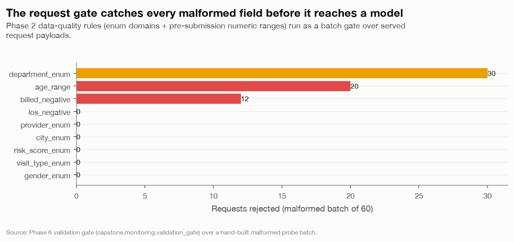
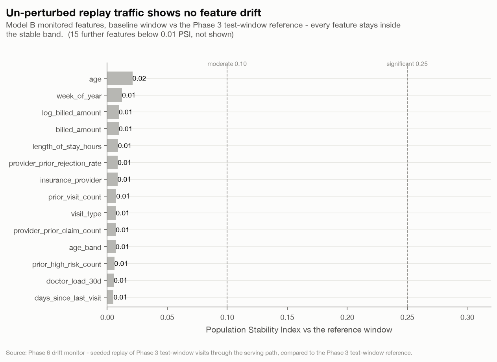
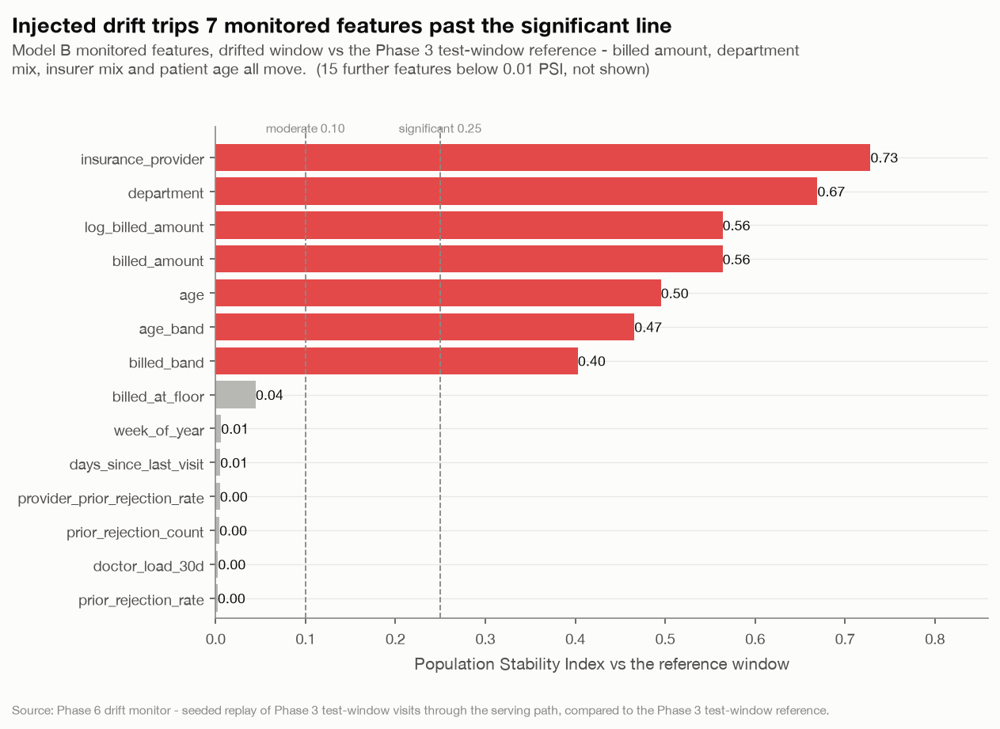
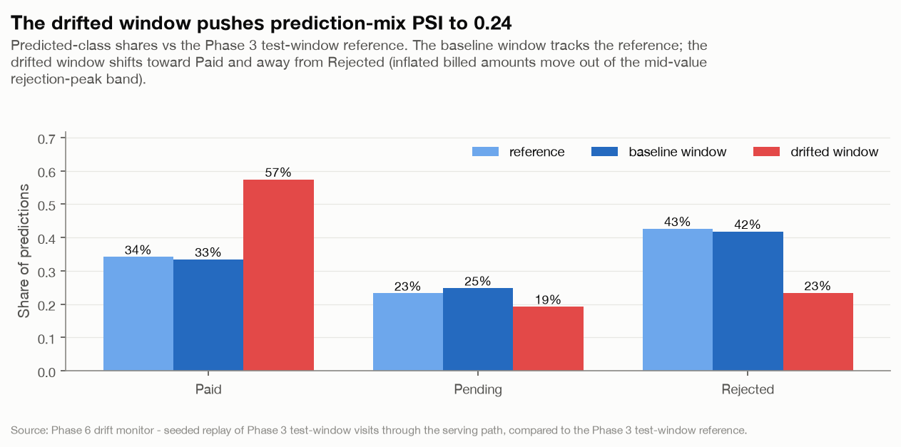
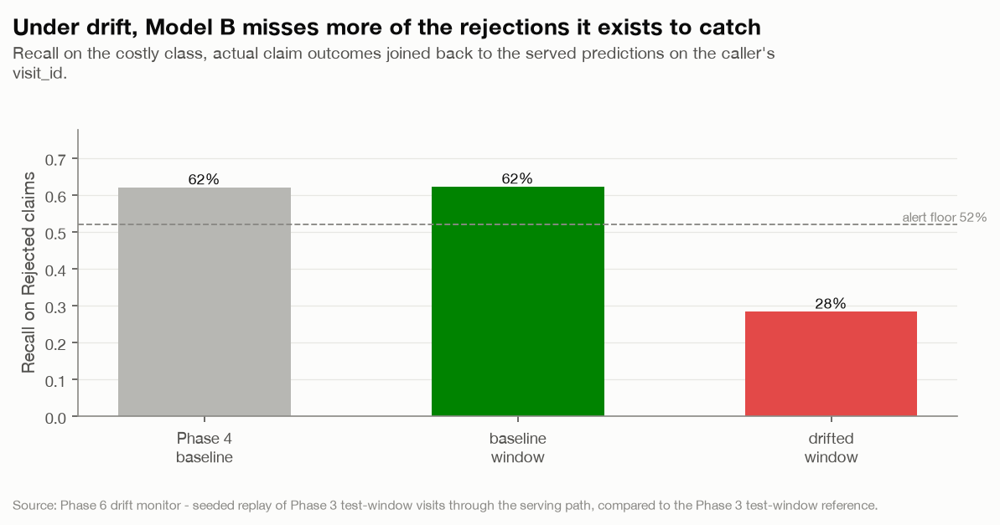
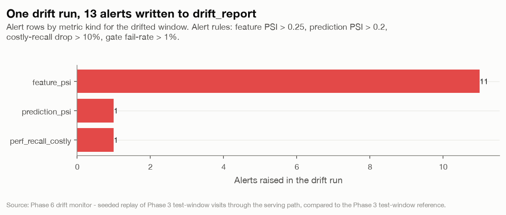

# Phase 6 - Monitoring, Drift Detection & Governance

*Hospital Operations & Revenue Risk Intelligence Platform*
*Generated 2026-09-04 11:32 UTC - regenerate with `uv run python phase6_monitoring/run_phase6.py`.*

## Executive summary

Phase 5 logs every prediction to `capstone_solution.prediction_log`. Phase 6
turns that log into a monitored signal: a **request validation gate**, a
**drift job** that compares served traffic to the Phase 3 reference
(`phase3-test 2025-11-20..2026-01-20`), an append-only **`drift_report`** table + audit
trail, a **scheduler** sidecar, and a **Grafana** dashboard - plus the
governance documents (`governance.md`, `retraining_policy.md`, `runbook.md`).

To exercise it end-to-end the job seeds two comparable windows into the log:
a **baseline** window (un-perturbed replay of Phase 3 test-window visits) and a
**drifted** window (the same traffic with a deliberate shift in billed amount,
department mix, insurer mix, patient age and volume).

| Check | Baseline window | Drifted window |
|---|---|---|
| Drift-run status | **OK** | **ALERT** |
| Monitored features past the significant PSI line (Model B) | 0 / 29 | 7 / 29 |
| Predicted-class-mix PSI | 0.001 | 0.244 |
| Model B recall on Rejected (actuals joined) | 62.2% | 28.3% |
| Alerts written to `drift_report` | 0 | 13 |

The monitor is quiet on the baseline window and fires on every injected shift on
the drifted window - including the one that matters commercially: Model B's
recall on to-be-rejected claims falls 34 points below the
Phase 4 baseline, breaching the retraining trigger.

## 1. Request validation gate

Every served request is checked against the Phase 2 data-quality rules
(`capstone.data_quality`) reused as a batch gate - the enum domains
(`department`, `visit_type`, `gender`, `city`, `insurance_provider`,
`risk_score`) and the pre-submission numeric ranges (`age` 0-120,
`billed_amount >= 0`, `length_of_stay_hours >= 0`). A window fails the gate when
more than 1% of its requests offend.

- Clean probe batch (120 requests): fail rate 0.0% - **pass**.
- Malformed probe batch (60 requests): fail rate 73.3% - **rejected**.

*The validation gate rejects every malformed request in a 60-request probe batch; the clean batch of 120 passes with zero offences.*

## 2. Feature drift

The drift job rebuilds the exact model-input rows for a window from the logged
request payloads (via `capstone.serving.build_model_row` - the same assembly the
API uses), then scores each feature with **PSI** (deciles on the reference) and,
for numeric features, a two-sample **KS** test. Bands: stable `< 0.1`,
moderate `< 0.25`, significant `>= 0.25`. Model B
monitors 16 numeric + 13 categorical features - exactly its Phase 3
manifest list, so Model A is never compared on a billing distribution.

### 2.1 Baseline window - no drift

*Model B monitored features, baseline window vs the Phase 3 test-window reference - every feature stays inside the stable band.*

### 2.2 Drifted window - 7 features past the line

*Model B monitored features, drifted window vs the Phase 3 test-window reference - billed amount, department mix, insurer mix and patient age all move.*

## 3. Prediction-distribution drift

*Model B predicted-class mix: baseline PSI 0.001, drifted PSI 0.244 (alert threshold 0.2).*

The baseline window's predicted-class mix tracks the reference (PSI
0.001); the drifted window pushes it to
0.244, past the 0.2 alert threshold.

## 4. Performance drift

Once real outcomes land they are joined back to the served predictions on the
caller-supplied `visit_id`. For Model B the monitored business metric is
**recall on Rejected claims** at the operating threshold
(`P(Rejected) >= 0.19`), against the Phase 4 baseline of
62.0%.

*Model B recall on to-be-Rejected claims at P(Rejected) >= 0.19: 28% on the drifted window vs a 62% Phase 4 baseline - a 34-point drop that breaches the alert floor.*

Recall on the drifted window is 28.3% - a
34-point drop that breaches the
10-point retraining trigger. (Model A is a
base-rate monitor - it has no recall on High-risk visits by construction, so
only its risk-mix share is tracked.)

## 5. The drift_report table and alert rules

Every run writes one row per (metric) to `capstone_solution.drift_report` with a
shared `run_id`, `run_ts`, the window bounds, the metric value, the reference it
is judged against, its band, and an `alert` flag. This run wrote
**184 rows**.

*The drifted-window run raised 13 alerts across 3 metric kinds; the baseline run raised 0.*

Alert rules (one place - `capstone.monitoring.ALERT_RULES`, cited by
`governance.md`):

| Metric | Alerts when |
|---|---|
| `feature_psi` | any monitored feature PSI > 0.25 |
| `prediction_psi` | predicted-class-mix PSI > 0.2 |
| `perf_recall_costly` | recall on the costly class drops > 10 points vs the Phase 4 baseline |
| `gate_fail_rate` | > 1% of served requests fail the validation gate |

## 6. Governance and audit

- **`v_prediction_audit`** joins every `prediction_log` row to any
  `prediction_override` - the who / what / when for predictions and manual
  overrides. Sample:

| request_id                           | predicted_at                     | model   | model_version   | predicted_class   | override_class   | override_actor               | was_overridden   |
|:-------------------------------------|:---------------------------------|:--------|:----------------|:------------------|:-----------------|:-----------------------------|:-----------------|
| 8ed0a10f-730d-4426-af47-df7391cf2b88 | 2026-09-04 10:24:49.059499+00:00 | B       | 1.0.0           | Paid              | Rejected         | claims.lead@hospital.example | True             |
| 722d3ddc-e5df-4f48-80c1-2ffcb3b04b73 | 2026-09-04 10:24:49.059499+00:00 | A       | 1.0.0           | Low               | -                | -                            | False            |
| 43d3ad73-d371-4766-86c4-1f84cfdd7f80 | 2026-09-04 10:17:39.937444+00:00 | B       | 1.0.0           | Pending           | -                | -                            | False            |
| f9bc5ae3-0b50-45f7-a6fe-083bf232ca48 | 2026-09-04 10:17:39.937444+00:00 | A       | 1.0.0           | Low               | -                | -                            | False            |
| 2162e52a-d074-4319-9b44-c151c1f2ccba | 2026-09-04 10:10:30.815388+00:00 | B       | 1.0.0           | Paid              | -                | -                            | False            |

- **Manual override** rows record `actor`, `reason`, `original_class` and
  `override_class`. Example inserted this run: actor `claims.lead@hospital.example`,
  `Paid` -> `Rejected`
  ("Provider flagged prior-auth mismatch not visible to the model").
- **Append-only, enforced.** A trigger (`capstone_solution.forbid_mutation`)
  raises on any `UPDATE` to `prediction_log` / `drift_report` /
  `prediction_override`, and on `DELETE` to the two audit tables.
- Governance documents: **`governance.md`** (assumptions, limitations, the
  monitoring design, roles, data handling), **`retraining_policy.md`**
  (triggers, procedure, rollback, sign-off), **`runbook.md`** (incident
  response).

## 7. Operations - scheduler + Grafana

- **`phase6_monitoring/scheduler.py`** runs inside `docker compose` alongside
  Postgres, the API and Grafana: it applies the DDL, seeds the demo windows if
  the log is empty, then runs the drift job every `DRIFT_INTERVAL_SECONDS`.
- **`docker compose -f phase6_monitoring/docker-compose.yml up --build`** brings
  up `postgres` + `api` (`:8000`) + `scheduler` + `grafana` (`:3000`, anonymous
  viewer). The **Hospital Drift** dashboard reads `drift_report` and
  `prediction_log` directly: feature PSI over runs, predicted-class mix, Model B
  recall vs baseline, gate fail-rate, and the active-alert table.
- Cron equivalent (no Docker): `0 */6 * * * cd <solution> && uv run python -m
  phase6_monitoring drift-job --window last-week --fail-on-alert`.

## 8. Exit criteria

| Criterion | Status |
|---|---|
| Data validation gate on incoming requests (range/enum/schema), reusing Phase 2 rules | met - section 1 |
| Feature drift (PSI / KS vs the Phase 3 reference) | met - section 2 |
| Prediction-distribution drift | met - section 3 |
| Performance drift once outcomes land | met - section 4 (Model B, actuals joined on `visit_id`) |
| Scheduled drift job + threshold alerts | met - scheduler sidecar + `ALERT_RULES`; alerts on the injected drift |
| `drift_report` view/table | met - `capstone_solution.drift_report` (184 rows this run) |
| Audit log: who/what/when for predictions and overrides | met - `v_prediction_audit` + `prediction_override` |
| Audit log immutable-by-convention | met - enforced by trigger |
| Governance docs: assumptions, limitations, retraining policy, incident runbook | met - `governance.md`, `retraining_policy.md`, `runbook.md` |
| Drift job runs on a schedule and alerts on injected drift | met - scheduler + this run's drifted-window ALERT |

## 9. Hand-off to the executive presentation

The platform is complete end-to-end: SQL analytics -> EDA + feature catalogue ->
two calibrated models -> evaluation + model cards -> served API with a
prediction log -> **this monitoring + governance layer**. The final phase turns
it into a leadership deck: the operational / financial problem, the architecture
and data flow, headline SQL + EDA insights, model performance in money and risk
terms (Model B ~Rs 1.8 Cr/year recoverable at the operating point; Model A a
risk-mix monitor), and this deployment / monitoring / retraining story.

---

## Appendix - supporting tables

### Monitored feature drift - drifted window (Model B)

| feature                       | kind        |   psi |   ks_stat |   ks_pvalue | band        | drifted   |
|:------------------------------|:------------|------:|----------:|------------:|:------------|:----------|
| insurance_provider            | categorical | 0.728 |   nan     |     nan     | significant | True      |
| department                    | categorical | 0.669 |   nan     |     nan     | significant | True      |
| billed_amount                 | numeric     | 0.564 |     0.312 |       0     | significant | True      |
| log_billed_amount             | numeric     | 0.564 |     0.312 |       0     | significant | True      |
| age                           | numeric     | 0.495 |     0.291 |       0     | significant | True      |
| age_band                      | categorical | 0.466 |   nan     |     nan     | significant | True      |
| billed_band                   | categorical | 0.403 |   nan     |     nan     | significant | True      |
| billed_at_floor               | categorical | 0.045 |   nan     |     nan     | stable      | False     |
| week_of_year                  | numeric     | 0.006 |     0.018 |       0.863 | stable      | False     |
| days_since_last_visit         | numeric     | 0.005 |     0.013 |       0.993 | stable      | False     |
| provider_prior_rejection_rate | numeric     | 0.005 |     0.021 |       0.706 | stable      | False     |
| prior_rejection_count         | numeric     | 0.004 |     0.015 |       0.962 | stable      | False     |
| doctor_load_30d               | numeric     | 0.003 |     0.013 |       0.989 | stable      | False     |
| prior_rejection_rate          | numeric     | 0.002 |     0.022 |       0.697 | stable      | False     |
| day_of_week                   | numeric     | 0.002 |     0.009 |       1     | stable      | False     |
| city                          | categorical | 0.002 |   nan     |     nan     | stable      | False     |
| length_of_stay_hours          | numeric     | 0.002 |     0.013 |       0.995 | stable      | False     |
| prior_high_risk_count         | numeric     | 0.001 |     0.012 |       0.997 | stable      | False     |
| prior_visit_count             | numeric     | 0.001 |     0.014 |       0.988 | stable      | False     |
| has_prior_visit               | categorical | 0.001 |   nan     |     nan     | stable      | False     |
| is_first_visit                | categorical | 0.001 |   nan     |     nan     | stable      | False     |
| provider_prior_claim_count    | numeric     | 0.001 |     0.012 |       0.996 | stable      | False     |
| is_weekend                    | categorical | 0     |   nan     |     nan     | stable      | False     |
| risk_score                    | categorical | 0     |   nan     |     nan     | stable      | False     |
| los_at_floor                  | categorical | 0     |   nan     |     nan     | stable      | False     |
| visit_type                    | categorical | 0     |   nan     |     nan     | stable      | False     |
| gender                        | categorical | 0     |   nan     |     nan     | stable      | False     |
| month                         | numeric     | 0     |     0.002 |       1     | stable      | False     |
| chronic_flag                  | numeric     | 0     |     0.002 |       1     | stable      | False     |

### Predicted-class mix

| predicted_class   |   reference_share |   baseline_share |   drift_share |
|:------------------|------------------:|-----------------:|--------------:|
| Paid              |             0.342 |            0.334 |         0.574 |
| Pending           |             0.232 |            0.248 |         0.192 |
| Rejected          |             0.426 |            0.418 |         0.234 |

### Drift-report alert rows (this run)

| model   | metric_kind        | feature            |   value |   reference | band        |
|:--------|:-------------------|:-------------------|--------:|------------:|:------------|
| A       | feature_psi        | insurance_provider |   0.668 |        0    | significant |
| A       | feature_psi        | department         |   0.614 |        0    | significant |
| A       | feature_psi        | age                |   0.495 |        0    | significant |
| A       | feature_psi        | age_band           |   0.466 |        0    | significant |
| B       | feature_psi        | insurance_provider |   0.728 |        0    | significant |
| B       | feature_psi        | department         |   0.669 |        0    | significant |
| B       | feature_psi        | billed_amount      |   0.564 |        0    | significant |
| B       | feature_psi        | log_billed_amount  |   0.564 |        0    | significant |
| B       | feature_psi        | age                |   0.495 |        0    | significant |
| B       | feature_psi        | age_band           |   0.466 |        0    | significant |
| B       | feature_psi        | billed_band        |   0.403 |        0    | significant |
| B       | prediction_psi     | -                  |   0.244 |        0    | moderate    |
| B       | perf_recall_costly | Rejected           |   0.283 |        0.62 | alert       |

### Seed summary

{'removed_prior': 0, 'baseline_requests': 1800, 'drift_requests': 2800, 'baseline_visits': 900, 'drift_visits': 1400, 'model_version': '1.0.0'}
